# Lab 02 实验报告

## 实验内容

* 根据实验框架，完成贝叶斯网络手写数字识别
* 根据实验框架，完成KMeans算法实现图片不同粒度压缩
* 根据实验框架，编写Transformer，实现对于文本的预测

## 贝叶斯网络

### 实验原理

* 在贝叶斯网络中，我们维护了三个表：

  * labels_prior：每种数字的先验概率表
  * pixels_prior：一个二维表，维护了图中每个像素为0或1的先验概率
  * pixels_cond_label：一个三维表，记录了图中每个像素在图示数字已知的条件下为0或1的概率

* 在fit中，我们对这三个表进行维护，其具体方法是**对每一个样本的表示数字、每一个像素的亮暗进行频数统计，最后除以样本数得到两个先验概率。条件概率只需要用每个像素在图示数字已知的条件下为0或1的频数，除以每一个样本表示数字的频数即可获得**，实现代码如下：

  ```python
  def fit(self, pixels, labels):
      """
      pixels: (n_samples, n_pixels, )
      labels: (n_samples, )
      """
      n_samples = len(labels)
      # calculate prior probability and conditional probability
      # 计算先验概率
      for i in range(n_samples):
          # 计算结果的先验概率
          self.labels_prior[labels[i]] += 1
          for j in range(self.n_pixels):
              # 对每一个像素j，计算其为0或1的先验概率
              self.pixels_prior[j][pixels[i][j]] += 1
              # 计算每一个像素j为0或1时，结果为labels[i]的先验概率
              self.pixels_cond_label[j][pixels[i][j]][labels[i]] += 1
      for i in range(self.n_pixels):
          for j in range(self.n_values):
              for k in range(self.n_labels):
                  # 计算每一个像素j为0或1时，结果为k的条件概率
                  self.pixels_cond_label[i][j][k] /= self.labels_prior[k]
      self.labels_prior /= n_samples
      self.pixels_prior /= n_samples
  ```

* 在预测阶段，对于每一幅图片，我们可以假设其为0——9的任意数字，计算每个数字在当前图像分布下的的后验概率，具体方法是**使用表示数字的先验概率，乘以每个像素在表示这个数字的条件下为当前图片中这个像素值的概率**，最后选择概率最高的数字即可。代码实现如下：

  ```python
  def predict(self, pixels):
      """
      pixels: (n_samples, n_pixels, )
      return labels: (n_samples, )
      """
      n_samples = len(pixels)
      labels = np.zeros(n_samples)
      # predict for new data
      for i in range(n_samples):
          # 计算每一个结果的后验概率
          posterior = np.zeros(self.n_labels)
          for j in range(self.n_labels):
              posterior[j] = self.labels_prior[j]
              for k in range(self.n_pixels):
                  posterior[j] *= self.pixels_cond_label[k][pixels[i][k]][j]
          labels[i] = np.argmax(posterior)
      return labels
  ```

### 实验结果

实验结果得分如下：

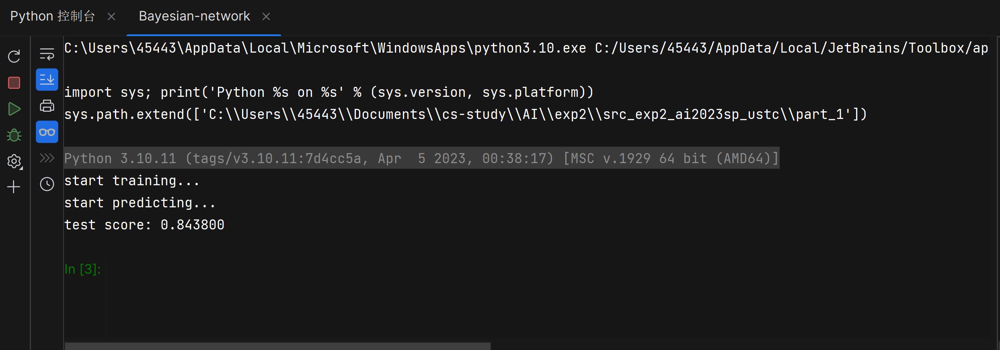

贝叶斯网络预测正确率可以达到84%

## KMeans算法

### 实验原理

* KMeans算法首先需要取出初始的k个中心点，这里已经由代码框架实现好了

* 接下来，KMeans算法会指定一个迭代次数，在迭代中，KMeans算法需要执行两个过程：

  * Assign：每一个数据点都找到距离其最近的一个中心点，如此使得每一个中心点附近形成一个数据点聚簇：

    ```python
    def assign_points(self, centers, points):
        """
        centers: (n_clusters, n_dims,)
        points: (n_samples, n_dims,)
        return labels: (n_samples, )
        """
        n_samples, n_dims = points.shape
        labels = np.zeros(n_samples)
        for i in range(n_samples):
            min_dist = np.inf
            for j in range(self.k):
                dist = np.linalg.norm(points[i] - centers[j])
                if dist < min_dist:
                    min_dist = dist
                    labels[i] = j
        return labels
    ```

  * Update：使用每个聚簇中所有点的平均值作为这个聚簇的新中心：

    ```python
    def update_centers(self, centers, labels, points):
        """
        centers: (n_clusters, n_dims,)
        labels: (n_samples, )
        points: (n_samples, n_dims,)
        return centers: (n_clusters, n_dims,)
        """
        # Update the centers based on the new assignment of points
        for i in range(self.k):
            centers[i] = points[labels == i].mean(axis=0)
        return centers
    ```

* 在经过设定的迭代次数后，KMeans算法终止，输出结果。

### 实验结果

* k = 2：

  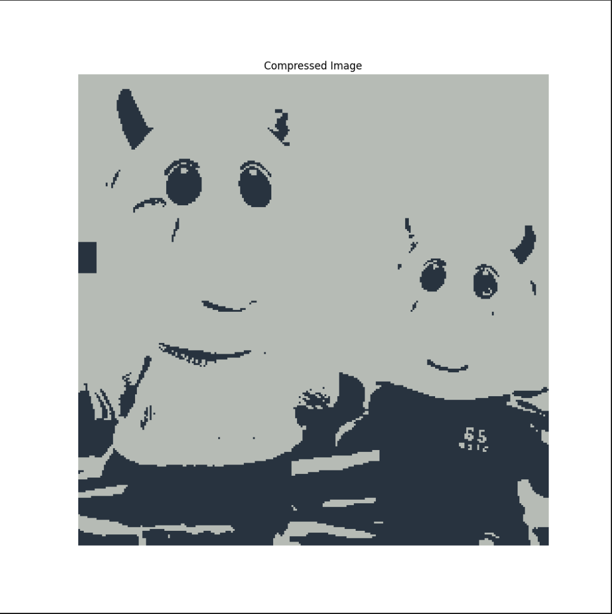

* k = 4：

  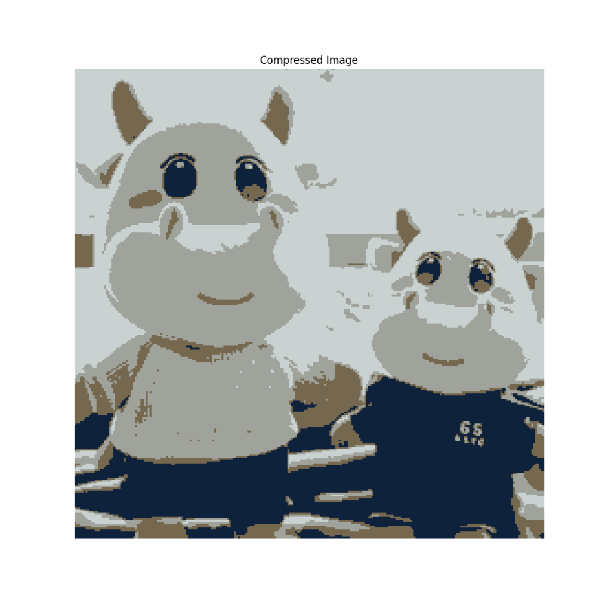

* k = 8：

  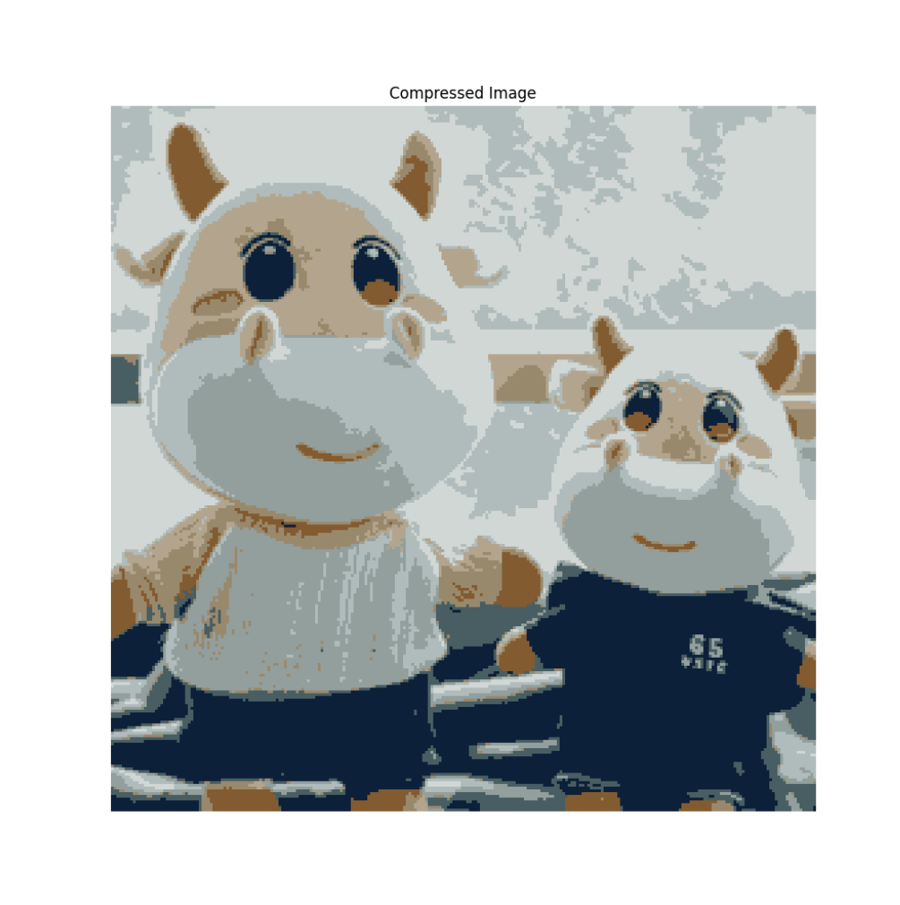

* k = 16：

  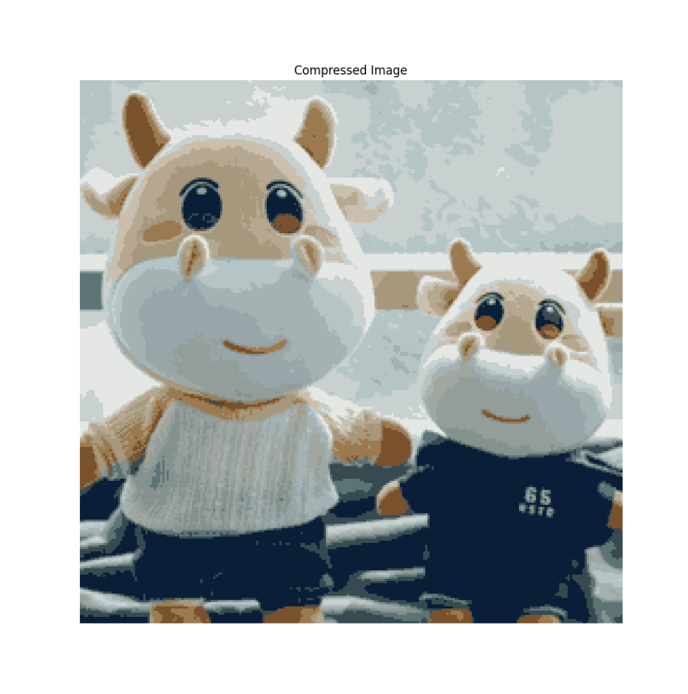

* k = 32：

  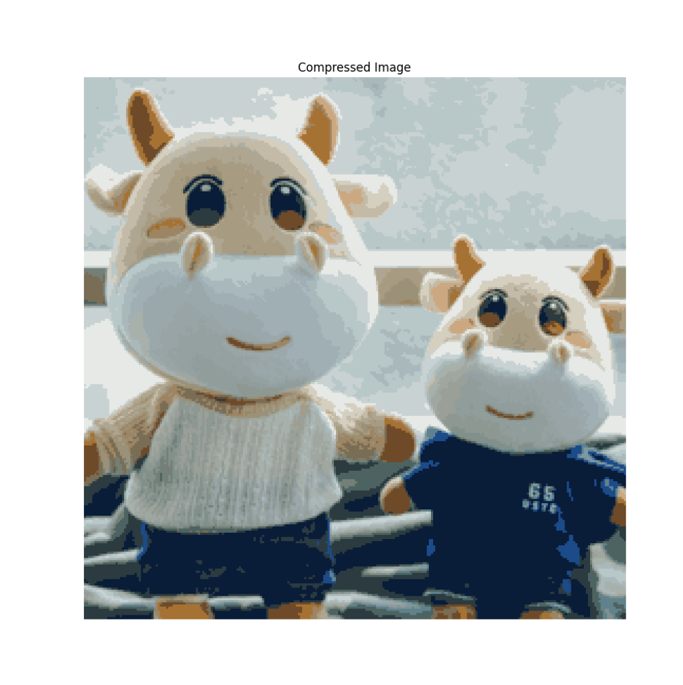

## Transformer

### 实验原理

* 数据清洗：

  由于原文中存在大量的剧中人名字和空行，非常影响学习效果，因此我将其全部去除。事实上在经过测试后，去除了这部分无效数据后，预测的原文中有效词的频率提升了很多

* CharTokenizer：

  在这个类中，最主要的方法就是编码和译码，这里只需要维护一个字典即可：

  ```python
  def encode(self, string: str):
      # convert a string into a list of integers and return, using the dictionary you created above
      encoded = [self.char2int[char] for char in string]
      return encoded
  def decode(self, codes: List[int]):
      # convert a list of integers into a string and return, using the dictionary you created above
      decoded = [list(self.char2int.keys())[list(self.char2int.values()).index(code)] for code in codes]
      return "".join(decoded)
  ```

  除此之外，我也构造了save和load方法，用以保存住这个字典，供后续模型调用使用

* Head：

  这里的Head类是带掩模的，通过对K、Q、V三个矩阵进行矩阵乘法和掩模操作，实现了每一个头部的attention计算，具体实现方法如下：

  ```python
  def forward(self, inputs):
      Key = self.Key(inputs)
      Query = self.Query(inputs)
      Value = self.Value(inputs)
      # Q @ K^T / sqrt(d_k)
      affinity = torch.matmul(Query, Key.transpose(-1, -2)) / (Key.size(-1) ** 0.5)
      # mask out the upper triangular part of the affinity matrix
      time = inputs.size(1)
      affinity = affinity.masked_fill(self.tril[:time, :time] == 0, -torch.inf)
      affinity = funct.softmax(affinity, dim=-1)
      # V @ softmax(Q @ K^T / sqrt(d_k))
      out = torch.matmul(affinity, Value)
      return out
  ```

* MultiHeadAttention：

  在多头注意力计算类中，实现的方法非常简单，只需要不断调用Head类中的方法即可：

  ```python
  class MultiHeadAttention(nn.Module):
      def __init__(self, _n_heads, head_size):
          super().__init__()
          # create a list of heads
          self.heads = nn.ModuleList([Head(head_size) for _ in range(_n_heads)])
          # create a linear layer that maps from n_heads * head_size to n_embd
          self.projection = nn.Linear(_n_heads * head_size, n_embd)
  
      def forward(self, inputs):
          out = torch.cat([head(inputs) for head in self.heads], dim=-1)
          return self.projection(out)
  ```

* PositionalEncoding：

  这个类是我新加入的，目的是为了在词嵌入后进行一次位置编码，以增强学习时对于位置信息的感知。位置编码仅仅和词的位置、总词的长度有关，因此可以在得知block size的基础上事先存储好编码，在学习时直接应用即可：

  ```python
  class PositionalEncoding(nn.Module):
      def __init__(self, _n_embd):
          super().__init__()
          # calculate the positional encoding and store it in a buffer
          self.n_embd = _n_embd
          self.encoding = torch.zeros(block_size, _n_embd, device=device)
          self.encoding.requires_grad = False
          pos = torch.arange(0, block_size, device=device).unsqueeze(1)
          step = torch.arange(0, _n_embd, 2, device=device).float()
          self.encoding[:, 0::2] = torch.sin(pos / 10000 ** (step / _n_embd))
          self.encoding[:, 1::2] = torch.cos(pos / 10000 ** (step / _n_embd))
  
      def forward(self, inputs):
          _, time = inputs.shape
          return self.encoding[:time, :]
  ```

* FeedForward：

  在这个类中，我们只需要采用三层网络就可以实现，其中两层线性映射夹住ReLU层，通过映射到高维空间，转换后再映射回低维空间，FeedForward就可以达到这一层的目的

  ```python
  class FeedForward(nn.Module):
      def __init__(self, _n_embd):
          super().__init__()
          # implement the feed-forward network
          self.net = nn.Sequential(
              nn.Linear(_n_embd, 32 * _n_embd),
              nn.ReLU(),
              nn.Linear(32 * _n_embd, _n_embd),
          )
  
      def forward(self, inputs):
          return self.net(inputs)
  ```

* Block:

  一个Block事实上综合了MultiHeadAttention、FeedForward和若干层归一化（layer norm）单元，嵌入后的输入数据通过一个Block可以进行模型构建。在这里我也使用了Residual Connections策略来保证梯度能够在层间传递的过程中不会消失：

  ```python
  class Block(nn.Module):
      def __init__(self, _n_embd, _n_heads):
          super().__init__()
          # create a layer normalization layer
          self.norm1 = nn.LayerNorm(_n_embd)
          # create a multi-head attention layer
          self.attn = MultiHeadAttention(_n_heads, _n_embd // _n_heads)
          # create another layer normalization layer
          self.norm2 = nn.LayerNorm(_n_embd)
          # create a feed-forward network layer
          self.ff = FeedForward(_n_embd)
  
      def forward(self, inputs):
          # Residual Connections
          out1 = self.norm1(inputs + self.attn(inputs))
          out2 = self.norm2(out1 + self.ff(out1))
          return out2
  ```

* Transformer

  * forward:

    forward是Transformer的关键方法，该方法通过调用嵌入模块、位置编码模块、若干Block以及规范化和线性化模块来完成对于句子的学习，具体方法已经在实验讲义中用图示表示的很清楚了，下面是我代码中不含损失计算的forward构建方法：

    ```python
    def forward(self, inputs, labels=None):
        # embedding:(batch, context, embedding)
        embedding = self.embedding(inputs)
        # positional_encoding:(context, embedding)
        positional_encoding = self.positional_encoding(inputs)
        # attens:(batch, context, embedding)
        attens = self.blocks(embedding + positional_encoding)
        # attens:(batch, context, embedding)
        attens = self.norm(attens)
        # logits:(batch, context, attens)
        logits = self.linear(attens)
    ```

  * generate：

    这个方法实现了对于句子词汇的预测，具体方法就是使用上述forward方法，通过softmax和multinomial对forward出的信息进行处理，获取到预测的新词，并将其连入已知句子，再进行下一个词的预测：

    ```python
    def generate(self, inputs, max_new_tokens):
        for _ in range(max_new_tokens):
            batch, time = inputs.shape
            logits, _ = self.forward(inputs[:, max(0, time + 1 - block_size):time + 1])
            logits = torch.softmax(logits[:, -1, :], dim=-1)
            logits = torch.multinomial(logits, num_samples=1)
            logits = logits.view(batch, 1)
            inputs = torch.cat([inputs, logits], dim=-1)
        return inputs
    ```

### 损失函数曲线统计

* 本次实验中，我降低了学习率到$10^{-4}$，并提高最大迭代次数到20000，每隔100次迭代就报告一次损失，获得损失曲线如下：

  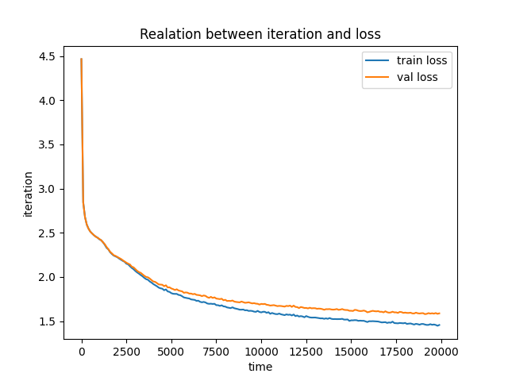

* 实验的具体数据我已经放在了提交包中，从具体数据可以看出，**两个loss最终基本都趋于收敛，且差距并不大**，证明本次训练是有效的训练

### 实验结果

* 对于文本中的内容，我们使用如下的测试：

  1. 原文：

     ```tex
     How now! what mean'st thou, that thou help'st me not?
     ```

     预测结果：

     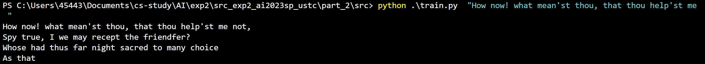

  2. 原文：

     ```tex
     To overgo thy plaints and drown thy cries!
     ```

     预测结果：

     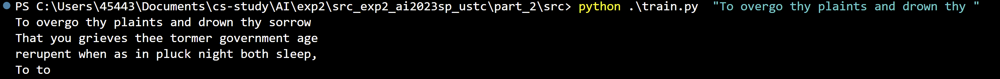

* 对于文本外的内容，我们使用如下的测试：

  1. 原文：

     ```tex
     To be, or not to be: that is the question.
     ```

     预测结果：

     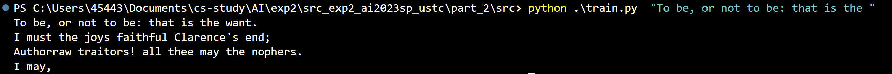

  2. 原文：

     ```tex
     Young men’s love then lies not truly in their hearts, but in their eyes.
     ```

     预测结果：

     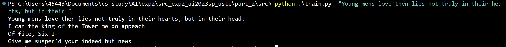

* 虽然对于上述句子的语义预测准确率非常低，但是可以看出，模型已经可以基本识别出单词的结构，补充的话也基本符合人类语法。受限于实验条件，我无法再通过加大规模来训练更准确的模型，但如果能调整参数加大规模，预测结果一定能更加准确

## 实验总结

通过本次实验，我有了如下收获：

* 基本掌握了贝叶斯网络和KMeans的具体实现，了解了这两种学习算法面向对象变成的思路
* 充分了解了Transformer的训练方法，并通过不断地分析调整找到了较好的训练方式，训练效果差强人意
