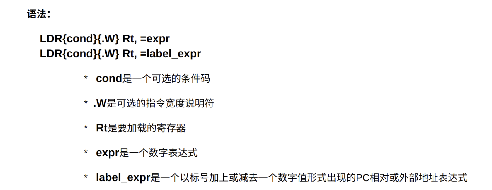
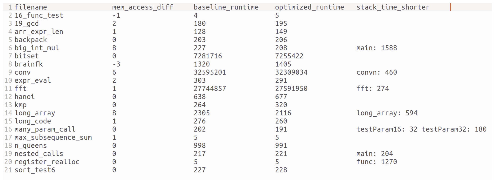
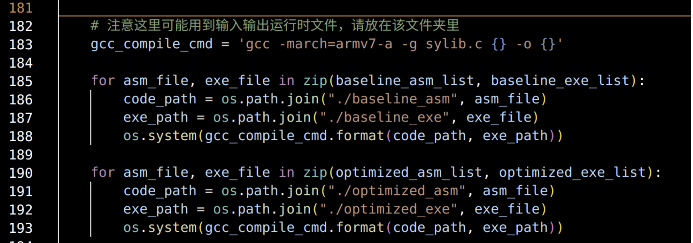

# Report

## 思考题

### Question 1

ARM编译器处理超范围立即数时，使用LDR伪指令完成立即数加载：



这个LDR并不是ldr指令。当立即数大到不能使用一条MOV指令解决时，就会将这个变量存储在文字池里，然后生成一个pc相对寻址，使用ldr指令将这个立即数加载入寄存器。

### Question 2

 不可以。我们来看一种情况：

|      | 1    | 2    | 3    |
| ---- | ---- | ---- | ---- |
| SRC  | op0  | op0  | op0  |
| DST  | op1  | op2  | op3  |

这是一个“一对多赋值”，表中给出的是虚拟寄存器编号。

如果将op0分配r0，则op1、op2、op3都要分配给相同的寄存器（例如是r1），那么后面一旦出现op2定值后引用op3的值的情况，就会出错（因为这时op2和op3都是r1，作为op2的r1值已经被修改，op3的值自然也被修改）。分配内存地址是相同道理。因此不能采用这种方式来规避phi指令移动。

### Question 3

* 针对函数调用ABI，可以将临时寄存器的优先级降低，这样可以减少使用临时寄存器时的保存。同时，我们应当将r0-r3的优先级降低，这样在内部调用函数时，可以减少对于r0-r3的保存。当然，我们可以直接把r0-r3设为临时寄存器，这样方便了编译的实现。
* 针对Phi指令，可以尽可能将数据移动的源位置和目的位置分配到同一个物理寄存器上，这样就减少了数据移动的指令条数。同时，Phi指令是全部并行的，这对“环赋值”这种情况是重大的打击，因此最好能将寄存器分散分配，但这很有可能造成寄存器分配时冲突加剧，因此这里需要进行权衡。有关这种问题的体现，请参加下文中DataMove的实例展示。

## 实现思路

### 寄存器分配

我们实现了两种寄存器分配算法：贪婪算法和线性扫描算法。

#### 线性扫描算法

线性扫描算法作为非优化算法，基本借鉴了LLVM3.0之前的方法：按照开始时间线性扫描所有区间，并在没有寄存器可以分配时，使用代价函数决定如何溢出，显然这种算法的时间复杂度$O(n)$。

和传统的LLVM不同，我们的代价函数不是从末尾距离当前位置的距离，而是因为如果变量占据未来的时间太长，更容易引起冲突。事实上，在LLVM2.6之前，这种启发式溢出算法被认为是相当不错的启发式算法。

#### 贪婪算法（第二次机会优化）

我们将贪婪分配算法作为优化算法，这种算法是基于LLVM3.0的思路，采用贪心算法来优化寄存器分配策略。

线性扫描算法在分配时，如果不溢出则无视掉了一个重要的指标：interval长度（也就是末尾的to和首端的from的差值）。并且，线性扫描算法是以“当前时间节点”来进行分析，这未尝不是一种过于局部的眼光。

我们的贪婪分配算法，利用全局眼光，**使用interval长度构建优先级队列，使用寄存器使用频率——也就是所有range占据总长度的比重——作为代价函数**。之所以使用interval长度构建优先级队列，是因为我们认为：**短interval有很大可能塞入长interval的空隙中，特别是稀疏的长interval**。

在每一次分配寄存器前，当我们从优先级队列中取出一个interval后，我们先扫描所有已经分配的寄存器，试图直接就将这个interval塞入某个寄存器。如果成功塞入，那么这个寄存器的溢出权重就定义为是所有塞入其中的interval的溢出权重之和。之所以不重新计算这个寄存器的使用频率，是因为我们考虑到，**如果一个寄存器中有更多的变量，那么它的溢出代价应该更高，直接相加的溢出代价确实更高**，这是基于我们之前的测试得出的结论，也更能代表这一部分的溢出代价。

如果没有寄存器可以塞入这个interval，那么就尝试分配一个空闲寄存器，如果目前已经没有空闲寄存器了，那么就在这个新的interval和所有寄存器的溢出代价比较，选中一个最小的。**注意，这里并不是将替换掉的所有interval全部放入栈中，而是先放入一个溢出列表中**，这样是为了最后给予第二次机会来重新分配寄存器。

处理好所有interval后，我们再尝试**对溢出列表中的interval再分配**。由于IR框架，我们无法容易地对interval进行拆分，所以我们只能重新分配。第二次重新分配的意义是：**在一定程度上避免寄存器的溢出代价极差，使得被更高频区间淘汰的高频区间可以重回寄存器，这样可以拯救很多在计算密集区域被高频使用的变量。**

以上就是我们的贪婪分配算法。经过实际测试，**贪婪优先算法基本一直优于线性扫描算法**。我们使用“栈上总时间”，即每一个栈上变量的interval中的有效时间来衡量算法优劣。

这里请关注最后一列，最后一列是优化算法栈上变量的interval有效时间较未优化的减少量，效果比较显著。



贪婪分配算法的时间复杂度主要来自于查找插入寄存器的编号，每一次最坏情况下要查找全部寄存器的全部区间，若总Invterval数为n，每个区间平均拥有range数为m，则时间复杂度显然为$O(m\times n^2)$

### 数据移动

对于数据移动，我们也实现了两种算法：线性构建和图构建。在说明这两种算法之前，我先来简述一下我们对于实验的基本配置：

* 临时数据移动寄存器：固定为12号寄存器。我们修改了single_data_move，每次需要使用12号寄存器之前先将其压栈，使用完毕后弹出。为此，我们所有的数据移动栈空间从$sp-8$的位置开始分配，预留出的$sp-4$的位置用来保存12号寄存器（这是因为数据移动不会出现嵌套，所以一块栈空间已经足够）。

  同时，12号寄存器也被我们赋予最低的分配优先级，这样可以减少对12号寄存器的正常使用。

* lr寄存器的处理：由于safe_store和safe_load需要使用lr寄存器，所以，在算法开始前先对两个列表进行遍历，一旦遇到某个src和dst满足两种移动调用条件，就在$sp-8$位置存储lr，在整个调用结束后再加载回lr

#### 线性构建

这是比较简单直观的构建方法。我们对src数组线性扫描，如果某个源位置对应目的位置不在后续的源中出现，那么这组赋值就是与后续不相关的，否则我们将这个目的位置存储的值放入栈顶指针低地址，也就是没有被分配的内存区中，之后如果要使用个寄存器，就需要从内存中将其加载出来。如果与后续不相关，那么就可以直接完成赋值。

如果有n组赋值，那么这种算法的时间复杂度为$O(n^2)$，它的优点就是当环比较少时，编译器效率较高，但一旦存在环，就需要把环上大部分的节点都放入内存，造成大量的访存开销。此外，对于相关较多的线性赋值，也会造成不必要的开销（如:r1->r2, r2->r3, r3->r4，需要把r2和r3全部放入内存）。

#### 图构建

图构建是我组在优化时使用的算法。使用图构建，可以做到**使用内存空间数和圈数同数量级**，如果没有lr和r12的存储，那么内存空间数就等于圈数。这种算法在无圈时完全最大化避免了访存，生成的代码效果也极好，在同寄存器分配算法下，完全优于线性构建。

图构建分为以下几步：

* **图的创建**：每一个源、目的位置都是一个节点，而每一个赋值关系都是一条边。用此来创建一个图。
* **破圈**：使用深度优先搜索破除图中所有的圈。当找到一个圈时，就把最后找到的这条边的源放入内存，并破掉这条边，将其加入“被破边”集合。显然，这一步的有效依赖于一个事实：**任何两个目的节点不相同**。这一步的结果就是将图转化为了森林。若生成N个森林，则时间复杂度为$O(V\times (V+E)$)
* **拓扑排序**：将转化好的森林进行拓扑排序，获得一个节点序列。拓扑排序的时间复杂度为$O(V+E)$
* **逆向扫描拓扑序列**：对拓扑序列逆向扫描，生成将在森林中其父亲的值赋值给这个节点的代码。这一步的时间复杂度为$O(V)$
*  **处理被破边**：对被破边，从内存中读取其值并赋给目的节点即可。这一步的时间复杂度为$O(E-V+N)$

到这里，数据移动完毕。为了支持这样的算法，我们需要构建构建向量—偏移表，来在生成代码时索引到对应的内存位置。同时，深度优先搜索和拓扑排序我们没有使用递归，而是使用了栈和队列来完成。这样的算法时间复杂度为$O(V\times (V+E))$，由于在本情况下，V和E是同数量级，都和赋值对数n同数量级，因此这种算法的时间复杂度也为$O(n^2)$

这里是一组算法效果对比，请关注第二列。第二列是优化前数据移动访存次数和优化后的差值，可以看到基本为正数，但也有一小部分是负数。这部分的原因主要是：优化不仅是针对数据移动，也包括寄存器分配。由于寄存器分配比较集中，导致了图中会有一定的圈开销，因此访问存储次数会略多，但相对于算法的优良来讲，这一点开销可谓九牛一毛：


## 评测说明

**我们精选了20组可以表现优化效果的测试用例，将每一个测试用例的参考输出中，returncode前加入了一个空行，存入standard_result文件夹下，用于对比结果正确性。其余评测用例均已核验，可以通过相同的方法核验正确性。**

若平台评测不受时间限制，则只需点击“评测”即可输出结果。

但由于平台时间限制，所以有一定的可能超时，所有的评测必须分两步来进行：

* 在本地执行build_asm.sh，构建出所有的汇编文件

* 将student文件夹打包，上传树莓派。在树莓派上运行run_exec.sh后，将student打包下载到本地。

* 在本地使用下载的student替换项目中的student（这样是为了将可执行文件放入项目）。之后注释掉run_exec.py中的两行编译命令（os.system语句）：

  

* 将整个项目上传到平台，点击评测即可。

针对评测生成的结果，我们做如下说明：

* baseline_output和optimized_output文件夹下，放置了所有测试用例的标准输出结果。其中，我们对每个测试用例都加入了currenttime计时功能（参考了PW7的代码），从而使得最后一行的输出为每个程序执行所用ticks。

* baseline_asm和optimized_asm文件夹下，放置了所有生成的汇编

* baseline_log.tab和optimized_log.tab中存放了每个测试文件的返回值

* input文件夹下为所有测试用例可能用到的输入文件

* baseline_report和optimized_report文件夹下，存放了编译成汇编文件过程中的一些统计数据，供run_exec.sh收集处理。

* stdout输出的信息说明：

  * 第一部分为编译，这一部分用来标识何时编译完毕

  * 第二部分为运行，这一部分会对运行结果与标准结果进行对比，如果没有匹配会报出问题

  * 第三部分为优化与不优化的对比表格：

    * 第一列为测试文件名

    * 第二列为数据移动时不优化与优化所占据的总内存空间差值

    * 第三列为不优化运行时间，第四列为优化运行时间，单位都为$10^{-6}$秒。这一组数据受到树莓派服务器性能和使用率等因素影响，在短程序中会有反常现象（大约会有100个单位的不稳定因素），属于正常现象。**可以重点关注bitset、conv和fft三个测试用例的运行效果**。

    * 第五列为寄存器分配时，不优化与优化结果的栈上变量总时间差值。

* **若评测结果为“权限不够”等报错，可以参考student文件夹下stdout.out文件来查看，这是我们本地进行的评测记录**

```c++
--------------------------compiling--------------------------
compiling asm to exe...
compiling finish!
---------------------------running---------------------------
running 16_func_test_optimized...           result matches
running 19_gcd_optimized...                 result matches
running arr_expr_len_optimized...           result matches
running backpack_optimized...               result matches
running big_int_mul_optimized...            result matches
running bitset_optimized...                 result matches
running brainfk_optimized...                result matches
running conv_optimized...                   result matches
running expr_eval_optimized...              result matches
running fft_optimized...                    result matches
running hanoi_optimized...                  result matches
running kmp_optimized...                    result matches
running long_array_optimized...             result matches
running long_code_optimized...              result matches
running many_param_call_optimized...        result matches
running max_subsequence_sum_optimized...    result matches
running n_queens_optimized...               result matches
running nested_calls_optimized...           result matches
running register_realloc_optimized...       result matches
running sort_test6_optimized...             result matches
running 16_func_test_optimized...           result matches
running 19_gcd_optimized...                 result matches
running arr_expr_len_optimized...           result matches
running backpack_optimized...               result matches
running big_int_mul_optimized...            result matches
running bitset_optimized...                 result matches
running brainfk_optimized...                result matches
running conv_optimized...                   result matches
running expr_eval_optimized...              result matches
running fft_optimized...                    result matches
running hanoi_optimized...                  result matches
running kmp_optimized...                    result matches
running long_array_optimized...             result matches
running long_code_optimized...              result matches
running many_param_call_optimized...        result matches
running max_subsequence_sum_optimized...    result matches
running n_queens_optimized...               result matches
running nested_calls_optimized...           result matches
running register_realloc_optimized...       result matches
running sort_test6_optimized...             result matches
-----------------------------------------------diffent table-----------------------------------------------
filename                mem_access_diff     baseline_runtime    optimized_runtime   stack_time_shorter                                              
16_func_test            -1                  5                   6                                                                                   
19_gcd                  2                   231                 226                                                                                 
arr_expr_len            1                   148                 139                                                                                 
backpack                0                   198                 231                                                                                 
big_int_mul             8                   214                 223                 main: 1588                                                      
bitset                  0                   7277268             7261584                                                                             
brainfk                 -3                  1413                1422                                                                                
conv                    6                   32584836            32267412            convn: 460                                                      
expr_eval               2                   306                 310                                                                                 
fft                     1                   27910566            27596752            fft: 274                                                        
hanoi                   0                   666                 652                                                                                 
kmp                     0                   305                 271                                                                                 
long_array              8                   2360                2182                long_array: 594                                                 
long_code               1                   334                 321                                                                                 
many_param_call         0                   213                 188                 testParam16: 32 testParam32: 180                                
max_subsequence_sum     1                   7                   6                                                                                   
n_queens                0                   954                 955                                                                                 
nested_calls            0                   223                 204                 main: 204                                                       
register_realloc        0                   6                   4                   func: 1270                                                      
sort_test6              0                   201                 231                                                                                 
```

## 参考文献

* [LLVM3.0中的寄存器贪婪分配](https://blog.csdn.net/wuhui_gdnt/article/details/51800101)
* [LLVM寄存器分配（一）](https://zhuanlan.zhihu.com/p/55287942)
* [LLVM寄存器分配（二）](https://zhuanlan.zhihu.com/p/56409890)