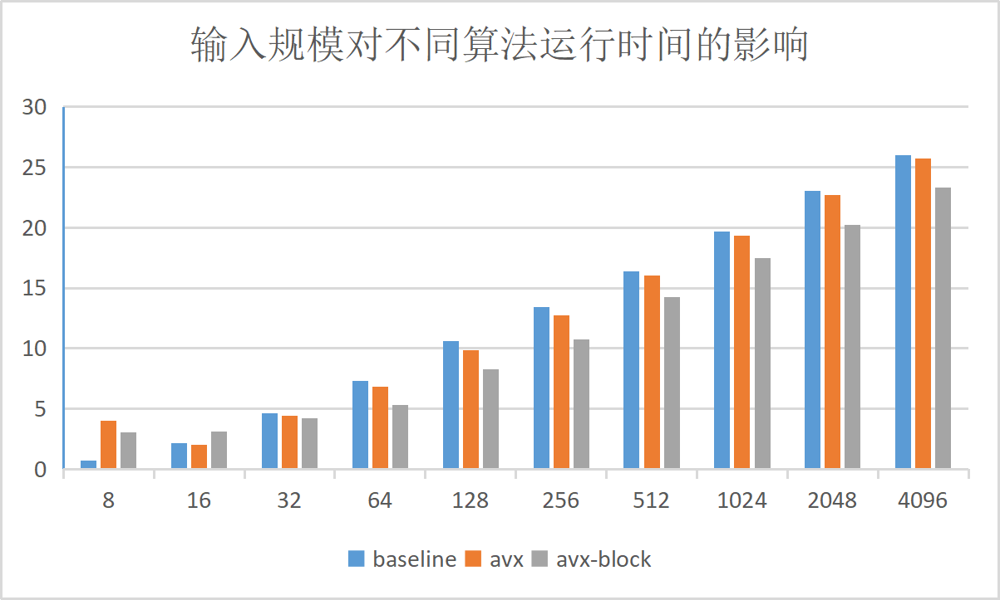
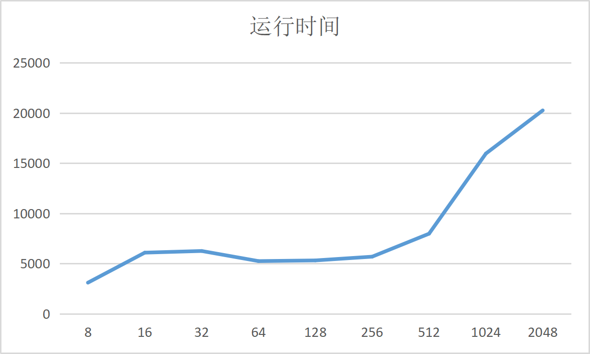
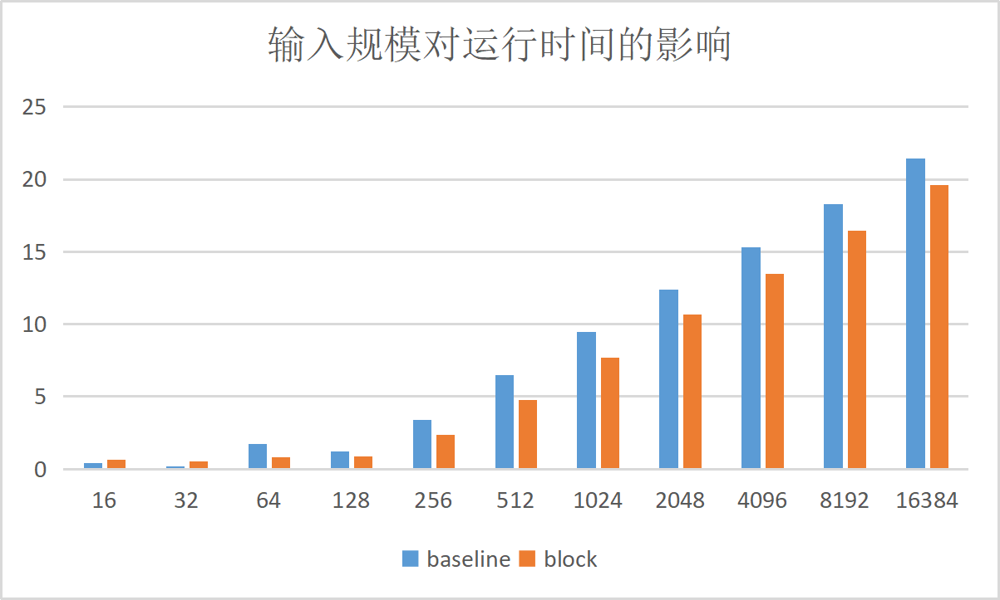
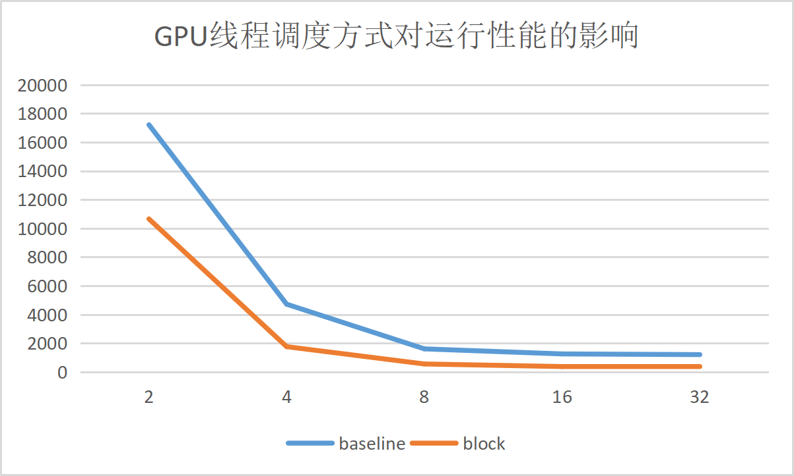

# Lab 5 实验报告

## CPU实验

### 设备信息

> 设备名称	madrid
> 处理器	Intel(R) Core(TM) i7-10750H CPU @ 2.60GHz   2.59 GHz
> 机带 RAM	32.0 GB (31.8 GB 可用)
> 设备 ID	69D7476B-088C-4BE6-83C0-576E3F3D31AD
> 产品 ID	00330-80000-00000-AA745
> 系统类型	64 位操作系统, 基于 x64 的处理器
> 笔和触控	为 10 触摸点提供触控支持
>
> 调试环境 	CLION 2023.01

### 算法实现

#### AVX矩阵乘法

* 这里主要是通过256位的向量寄存器，结合矩阵乘法的公式，将B矩阵横向展开进行计算，其中我充分利用了处理器中AVX寄存器，将算法进行了八次循环展开，一次循环即可算出八行的数据，具体算法详见源代码
* 除此之外，我也实现了一种类似于向量——向量乘法加速，在代码中通过宏定义来体现。经过测试，这种优化方法比上述的标量——向量乘法加速要好一些，但后续测试我们依然使用了上述实验要求的算法，具体算法代码请参考源代码。

#### AVX分块矩阵乘法

* 在这里我通过参数将矩阵划分为了若干个小矩阵，对每一个小矩阵内部利用AVX的算法先进行AVX优化，之后进行合并。值得注意的是，分块的遍历策略也十分具有意义：如果以ijk的循环深入顺序进行遍历，那么测得的运行时间几乎是以ikj的循环深入顺序遍历的5倍。

### 实验数据

#### 输入规模对不同算法的影响

注：时间单位为毫秒，分块大小为8

| 规模 | baseline | avx     | avx-block |
| ---- | -------- | ------- | --------- |
| 8    | 0.0004   | 0.004   | 0.002     |
| 16   | 0.0011   | 0.001   | 0.0021    |
| 32   | 0.0059   | 0.0052  | 0.0046    |
| 64   | 0.0382   | 0.0274  | 0.0099    |
| 128  | 0.3795   | 0.2278  | 0.0753    |
| 256  | 2.6703   | 1.6485  | 0.4243    |
| 512  | 20.5685  | 16.6148 | 4.7708    |
| 1024 | 208.304  | 162.64  | 44.8298   |
| 2048 | 2104.17  | 1632.49 | 301.57    |
| 4096 | 16539.4  | 13247.9 | 2491.93   |

下图为统计图标，其中纵轴为：
$$
log(运行时间)+12
$$

从上述数据中，我们可以做如下分析：

* AVX算法对于基础矩阵乘法的改进十分有限，这主要是由于，AVX算法在计算过程中仍然要每次遍历一整行的数据，特别是在规模比较大的时候，加之我对其做了循环展开，一次就要遍历八行的数据，这极有可能造成大量的高速缓存缺失，因此其改进效果也并不好
* AVX分块算法对于基础矩阵乘法的改进十分可观，由于其一次只取宽度为8的数据并集中进行大量运算，使得程序局部性较好，高速缓存缺失率大有降低。事实上，由于我在分块时还是现将每一个块进行8*8的展开，恰好一个256位寄存器可以容纳一整个行，因此大部分运算还是都在寄存器中进行的，这样对矩阵乘法的改进更加明显。

#### 分块大小对AVX分块乘法的影响

注：时间单位为毫秒，测试规模为N=2048

| 分块大小 | 运行时间 |
| -------- | -------- |
| 8        | 3091.93  |
| 16       | 6081.7   |
| 32       | 6247.38  |
| 64       | 5239.35  |
| 128      | 5307.26  |
| 256      | 5682     |
| 512      | 7968.7   |
| 1024     | 15955.4  |
| 2048     | 20257.3  |

下图为运行时间图像：

通过以上数据，我们可以做出如下分析：

* 由于AVX指令集的寄存器都是256位，恰好能放下8个float变量，因此一旦分块大小只有8，那么就会减少冗余的循环。在代码中，我通过ADDDOT宏定义来定义了一个专门为分块大小为8的分块策略优化的算法，由于没有过多的循环，其效率非常之高。
* 随着分块逐渐变大，可以看出，当分块没有超过系统高速缓存的大小时，运行时间基本是稳定的比较低，但随着分块变大，特别是到达512以上时，高速缓存涉及了大量的换入换出，而这时算法性能已经不如基本的AVX算法，且由于冗余的循环判断比较多，其性能也大打折扣

### 其他矩阵乘法优化策略

* BLAS库：B一组基本线性代数子程序，包括矩阵乘法、向量内积等基本操作。经过我的调研，BLAS库的优化方式主要包括以下几个方面：
  1. **基本算法的优化**：BLAS库中的矩阵乘法等基本算法采用了一系列优化手段，如分块算法、循环展开、寄存器重用等，以减少内存访问和提高计算效率。

  2. **优化针对不同硬件架构**：BLAS库中的算法会针对不同的硬件架构进行优化，例如使用SSE、AVX等SIMD指令集，以及使用多核心并行计算等技术，以充分发挥硬件的性能。

  3. **预编译和优化**：BLAS库的算法通常会在预编译时进行优化，例如进行常量折叠、函数内联、循环展开等操作，以提高代码的效率。

  4. **指定数据类型和存储方式**：BLAS库中的矩阵乘法等算法可以支持不同的数据类型和存储方式，例如支持单精度浮点数、双精度浮点数、复数等数据类型，并支持行主序和列主序等存储方式，以适应不同的应用场景。

* 多线程优化：通过并行计算，将计算任务分配给多个线程，以提高计算效率。在多线程优化中，可以采用以下几种手段：
  1. **线程池**：线程池是一种线程管理机制，通过预先创建一定数量的线程，将计算任务分配给线程执行，避免了线程的创建和销毁开销，提高了线程的复用率。
  2. **任务分割**：将大型计算任务分割成多个小任务，分别由不同的线程执行。任务分割需要根据任务的特点和硬件环境选择合适的分割方式，例如按行划分、按列划分、按数据块划分等。
  3. **并行编程框架**：并行编程框架可以简化并行计算的开发和管理，例如OpenMP、MPI等，通过共享内存或通信模型，可以实现多线程优化和分布式计算。

## GPU实验

### 设备信息

>Device Name : NVIDIA GeForce GTX 1650 Ti
>totalGlobalMem : 4294705152
>sharedMemPerBlock 49152
>regsPerBlock : 65536
>warpSize : 32
>memPitch : 2147483647
>maxThreadsPerBlock 1024
>maxThreadsDim[0 - 2] : 1024 1024 64
>maxGridSize[0 - 2] 2147483647 65535 65535
>totalConstMem : 65536
>major.minor : 7.5
>clockRate : 1485000
>textureAlignment : 512
>deviceOverlap : 1
>multiProcessorCount : 16

### 算法实现：分块乘法

* 矩阵乘法函数中，我使用不同的线程，通过规定步数，将A和B矩阵取到对应的共享内存中，之后进行一次线程同步，其后类似于向量相乘的方法，编号为threadIdx的线程来计算位置为（threadIdx.y，threadIdx.x）位置的C矩阵
* 计算完毕后，需要再一次同步，之后将计算出的结果写到C矩阵中。

### 实验数据

#### 输入规模对运行性能的影响

注：时间单位为毫秒，分块大小为16

| N     | baseline | block    |
| ----- | -------- | -------- |
| 16    | 0.04096  | 0.048448 |
| 32    | 0.035104 | 0.045056 |
| 64    | 0.1024   | 0.054657 |
| 128   | 0.074016 | 0.057344 |
| 256   | 0.327232 | 0.158784 |
| 512   | 2.7745   | 0.844032 |
| 1024  | 22.0326  | 6.3617   |
| 2048  | 168.002  | 50.0942  |
| 4096  | 1247.34  | 355.581  |
| 8192  | 9996.01  | 2812.81  |
| 16384 | 89817.6  | 24865.5  |

上图中纵轴时关于运行时间的函数：
$$
log(运行时间)+5
$$
通过上述数据，我们可以做出如下分析：

* 在矩阵规模较大时，有效使用共享内存可以很好的加速矩阵乘法，其优化效果几乎为使用全局内存的四倍。这是因为，共享内存使得GPU各个线程只会对全局内存发起一次读操作，剩余步骤几乎全在内存中完成。
* 但当矩阵规模较小时，由于分块乘法需要进行数据搬运，数据搬运的时间已经不能再视为运算开销的小量，因此在规模极小时，基准乘法的效果反而会更好。
* 综上所述，分块乘法在运算较为密集时效果较好

#### GPU线程调度方式对运行性能的影响

在本次实验中，由于我为每一个矩阵子运算都分配了一个线程，因此BLOCK就应该等于blocksize，否则在分块矩阵乘法时，会有任务没有被分配线程，导致运行错误。因此我将对两个矩阵乘法的效果一起做出分析：

下列数据是在N=4096下获得：

| BLOCK_WIDTH | baseline | block   |
| ----------- | -------- | ------- |
| (2, 2)      | 17213.2  | 10652.4 |
| (4, 4)      | 4713.46  | 1755.48 |
| (8, 8)      | 1601.35  | 549.143 |
| (16, 16)    | 1249.76  | 370.309 |
| (32, 32)    | 1200.75  | 333.134 |

通过以上数据，我们可以做出如下分析：

* 对于baseline程序，随着块大小增加，其性能逐步提高。这主要是因为，块大小增加直接使得有更多的线程处在同一块中，可以使用共享内存进行通信，效率大大提高。值得注意的是，随着块大小增加，性能出现了边际效用递减的问题，这是因为随着块增大，可以使用共享内存进行通信的线程数也越来越多了，但这时由于共享内存沟通的线程已经很多，多合并入新的线程也不会产生质的变化。
* 对于分块程序，随着块大小增加，其性能逐步提高，其原因是，随着共享内存沟通的线程更多，每个线程取数据的步长也逐渐增大，循环次数减少，也就是说有更多的线程通过速度快的共享内存协作进行同一个块的运算，同步的次数也降低了，各个线程的大部分时间也都在进行有意义的计算。
