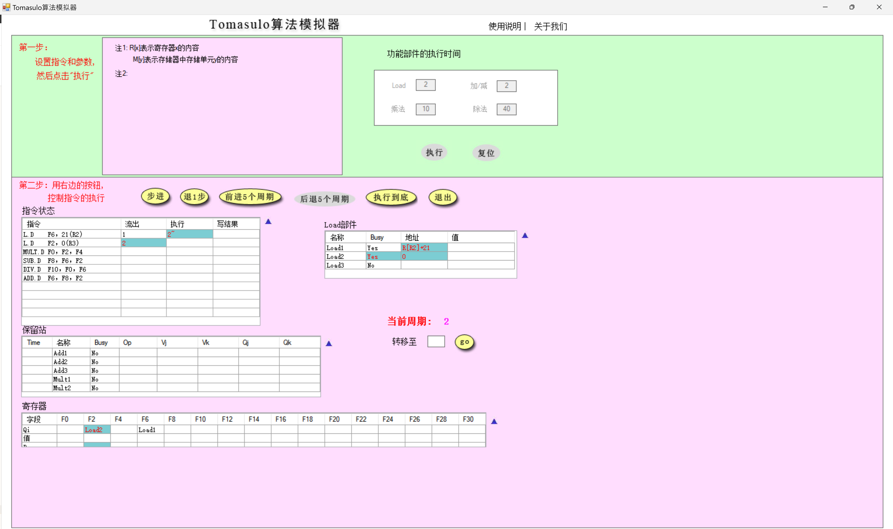

# Lab 6 实验报告

## Tomasulo算法模拟器

### 1

* 当前周期2：

  

  * Load1部件地址从偏移量21变为第一条指令的仿存地址$R[R2]+21$
  * Load2部件接收到了第二条指令的立即数偏移量0进入Busy状态
  * Load3处于空闲状态

* 当前周期3：

  

  * Load1部件获得了上一周期算出的地址的数据
  * Load2部件地址从偏移量0变为第二条指令的仿存地址$R[R3]+0$
  * Load3处于空闲状态

### 2

* MULT.D刚刚执行时是

  

  * 指令状态：MULT.D指令进入了执行状态，SUB.D指令进入了执行状态，同时ADD.D流出
  * 保留站：Add2保留站进入Busy状态，这是因为ADD.D进入了保留站，同时更新了Add2的表项。由于F8的值需要等待SUB.D的值，所以放在Qj中。由于F2的值已经在第二条L.D中算出，所以放在了Vk中；Mult1保留站中，由于乘法执行了一个周期，因此Time变为9
  * 寄存器：F6寄存器的值被定义为从ADD.D指令获得结果，同时将busy置位，表示这个值还没有准备完毕
  * Load部件：没有变化，因为此时两条L.D指令都执行完毕了

### 3

* MUL.D需要F2和F4两个源操作数，但是F2需要等待L.D指令的运算结果（需要2个周期），而MUL.D在L.D执行的第一个周期就流出了，因此暂时不能执行

### 4

* 15周期：

  

  在第15个周期，乘法执行完毕，保留站中Mult1的Time归零，同时指令状态是执行完毕

* 16周期：

  
  
  在第16个周期，乘法指令写回寄存器，Mult1恢复No busy状态，同时Mult2中的Vj源操作数准备完毕，保留站Mult2中Qj值消失，Vj值变为Mult1的结果。同时，寄存器F0的busy信号被复位，值也被赋值为乘法指令的结果

### 5

* 程序执行完毕是**57个周期**：

  

## 多Cache一致性算法-监听法

| **所进行的访问** | **是否发生了替换？** | **是否发生了写回？** | **监听协议进行的操作与块状态改变**                           |
| ---------------- | -------------------- | -------------------- | ------------------------------------------------------------ |
| CPU A 读第5块    | 是                   | 否                   | CPU A读Cache A，读不命中，将存储器第5块换入到Cache A第1行，并将其设置为共享 |
| CPU B 读第5块    | 是                   | 否                   | CPU B读Cache B，读不命中，将存储器第5块换入到Cache B第1行，并将其设置为共享 |
| CPU C 读第5块    | 是                   | 否                   | CPU C读Cache C，读不命中，将存储器第5块换入到Cache C第1行，并将其设置为共享 |
| CPU B 写第5块    | 否                   | 否                   | CPU B写Cache B，写命中，写入新数据向总线发出“作废第5块”的信号， Cache A和C的第1行数据被无效，Cache B第1行数据被CPU B写入，并将其设置为独占 |
| CPU D 读第5块    | 是                   | 是                   | CPU D读Cache D，读不命中，Cache B将其独占的第1行写回主存第5块，并将其设置为共享，Cache D将存储器第5块换入到第1行，并将其设置为共享 |
| CPU B 写第21块   | 是                   | 否                   | CPU B写Cache B，写不命中，将存储器第21块换入到Cache B第1行，CPU B写入新数据并将其设置为独占 |
| CPU A 写第23块   | 是                   | 否                   | CPU A写Cache A，写不命中，将存储器第23块换入到Cache A第3行，CPU A写入新数据并将其设置为独占 |
| CPU C 写第23块   | 是                   | 是                   | CPU C写Cache C，写不命中，Cache A将其独占的第3行写回主存第23块，并将其设置为无效， Cache C将存储器第23块换入到第3行，CPU C写入新数据并将其设置为独占 |
| CPU B 读第29块   | 是                   | 是                   | CPU B读Cache B，读不命中，Cache B将其独占的第1行写回主存第21块，将存储器第29块换入到Cache B第1行，并将其设置为共享 |
| CPU B 写第5块    | 是                   | 否                   | CPU B读Cache B，读不命中，Cache B将存储器第5块换入到Cache B第1行，并将其设置为共享 |

## 多Cache一致性算法-目录法

| **所进行的访问** | **监听协议进行的操作与块状态改变**                           |
| ---------------- | ------------------------------------------------------------ |
| CPU A 读第6块    | CPU A读Cache A，读不命中，本地向宿主节点发读不命中(A, 6)消息，宿主把数据块送给本地节点并写入第2行，设置第6块共享集合为{A}，Cache A将第2行设置为共享 |
| CPU B 读第6块    | CPU B读Cache B，读不命中，本地向宿主节点发读不命中(B, 6)消息，宿主把数据块送给本地节点并写入第2行，设置第六块共享集合为{A, B}，Cache B将第2行设置为共享 |
| CPU D 读第6块    | CPU D读Cache D，读不命中， 本地向宿主节点发读不命中(D, 6)消息，宿主把数据块送给本地节点并写入第2行，设置第6块共享集合为{A, B, D}，Cache D将第2行设置为共享 |
| CPU B 写第6块    | CPU B写Cache B，写命中，本地向宿主节点发写命中(B, 6)消息，宿主向远程节点A和D发作废(6)消息，设置第6块共享集合为{B}且为独占，Cache B将第2行设置为共享 |
| CPU C 读第6块    | CPU C读Cache C，读不命中，本地向宿主节点发写命中(C, 6)消息，本地向宿主节点发读不命中(C, 6)消息，宿主向远程节点Cache B发取数据块(6)的消息，Cache B将数据块(6)送给宿主节点并将第2行设置为共享，宿主把数据块送给本地节点Cache C，设置第6块共享集合为{B, C}，Cache C将第2行设置为共享， |
| CPU D 写第20块   | CPU D写Cache D，写不命中， 本地向宿主节点发送写不命中(D, 20)消息，宿主把第20块送给本地节点，设置第20块共享集合为{D}且为独占，CPU D将数据写入第0行，并将其设置为独占 |
| CPU A 写第20块   | CPU A写Cache A，写不命中，本地向宿主节点发送写不命中(A, 20)消息，宿主向远程节点Cache D发送取并作废(20)的消息，Cache D将数据块送给宿主节点并将其第0行作废，宿主把数据块送给Cache A，设置第20块共享集合为{A}且为独占，CPU A将数据写入第0行，并将其设置为独占 |
| CPU D 写第6块    | CPU D写Cache D，写不命中，本地向宿主节点发送写不命中(D, 6)消息，宿主向远程节点Cache B和C发送作废(6)消息，Cache B和C无效掉读的第2行，宿主把数据块送给本地节点Cache D，设置第6块共享集合为{D}且为独占，CPU D将数据写入第2行，并将其设置为独占 |
| CPU A 读第12块   | CPU A读Cache A，读不命中，本地向被替换的宿主节点发写回并修改共享集(A, 20)消息，并将第0行写回主存，宿主也将第20行设置为未缓冲。本地再向宿主节点发送读不命中(A, 12)消息，宿主将数据块送给本地节点，设置第6块共享集合{A}，Cache A将第0行设置为共享 |

## 综合问答

> **目录法和监听法分别是集中式和基于总线，两者优劣是什么？（言之有理即可）**

* 目录法：
  * 优点：目录维护了全局的状态信息，可以做到较为精确的一致性控制，同时也能够支持大规模处理器的共享。
  * 缺点：目录的维护和查询会带来一定的开销，尤其是在高并发的情况下，目录可能成为瓶颈。
* 监听法：
  * 优点：实现简单、开销较小，尤其适用于小规模的处理器共享。
  * 缺点：在大规模处理器共享的场景下，总线可能成为瓶颈，而且因为每个Cache都要监听总线，会导致大量的总线流量和能耗。

> **Tomasulo算法相比Score  Board算法有什么异同？（简要回答两点：1.分别解决了什么相关，2.分别是分布式还是集中式）（参考第五版教材）**

* 解决的相关问题：Tomasulo算法和Scoreboard算法都是用来解决指令的并行执行问题，但是它们关注的重点不同：
  * Scoreboard算法主要解决数据相关性的问题，即当一条指令需要等待另一条指令的结果才能执行时，如何正确地调度这些指令。
  * Tomasulo算法主要解决资源争用的问题，即如何避免因为多条指令需要使用同一资源而导致的冲突和等待。
* 分布式与集中式：
  * Scoreboard算法是一种集中式的指令调度算法，它会维护一个中央的Scoreboard数据结构，用于记录指令之间的相关性和依赖关系。
  * Tomasulo算法是一种分布式的指令调度算法，它将指令的执行单元和数据缓存记录分布在各个执行单元中，各个执行单元之间通过公共的缓存通信。

> **Tomasulo算法是如何解决结构、RAW、WAR和WAW相关的？（参考第五版教材）**

1. 结构相关：由于不同指令需要不同的功能单元执行，因此Tomasulo算法通过对每个功能单元的状态进行跟踪，来避免多个指令同时访问同一功能单元的问题。
2. RAW相关：Tomasulo算法使用操作数寄存器和保留站来解决RAW相关问题。在指令发射阶段，指令的操作数被存储在保留站中，而不是在寄存器文件中。当指令需要操作数时，它会从保留站中获取。如果一个指令需要等待其操作数，则它会被暂停，直到所有操作数都可用为止。
3. WAR相关：Tomasulo算法使用寄存器重命名来解决WAR相关问题，即使一个指令还需要某个操作数的旧值，也不会因为乱序写入而被影响，因为这个值依然还存在原先的映射物理寄存器中。同时，保留站中也在一个操作数可用时马上缓冲，就不需要再从寄存器中获取该操作数。
4. WAW相关：Tomasulo算法也使用寄存器重命名来解决WAW相关问题。通过寄存器重命名，同一个逻辑寄存器前后两次写入会被命名成两个不同的物理寄存器，从而消除了旧值因乱序而掩盖新值的情况。
