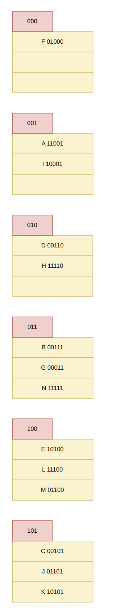

# HW 04

PB20111623 马子睿

## 1

* 插入35：

  

* 插入16：

  

* 插入38：

  

## 2

1. 不能在title上创建B+-Tree索引来提升查询效率，因为B+树提升查询效率的原理是B+树可以将查询对象通过序关系逐层查询，快速减少查询规模，但本题中关键词本身难以确定，同时数量也不确定，另外关键词和title之间的映射关系相当复杂，这种转换也使得B+树查找变得非常困难，所以使用B+树完成这样的查询不能很好的提高性能

2. 我们可以构建一个带间接桶的辅助索引

   * 对于每一篇paper，在插入时将title内所有的关键字都提取出来，并将对应的关键字桶指向这篇paper
   * 在查询时，将用户给出的关键字对应的所有桶都取出，取交集即可获得包含这些关键字的paper

   示例如下：

   

## 3

1. 插入a到n后格局如下：

   

   全部插入后一共有6个桶，E所在桶的全部键值为：E 10100, I 10001, K 10101

2. 全部插入后格局如下：

   

一共有6个桶，B所在桶中键值为：B 00111, G 00011, N 11111