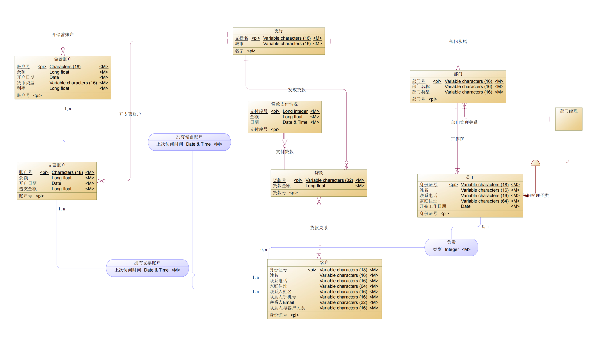
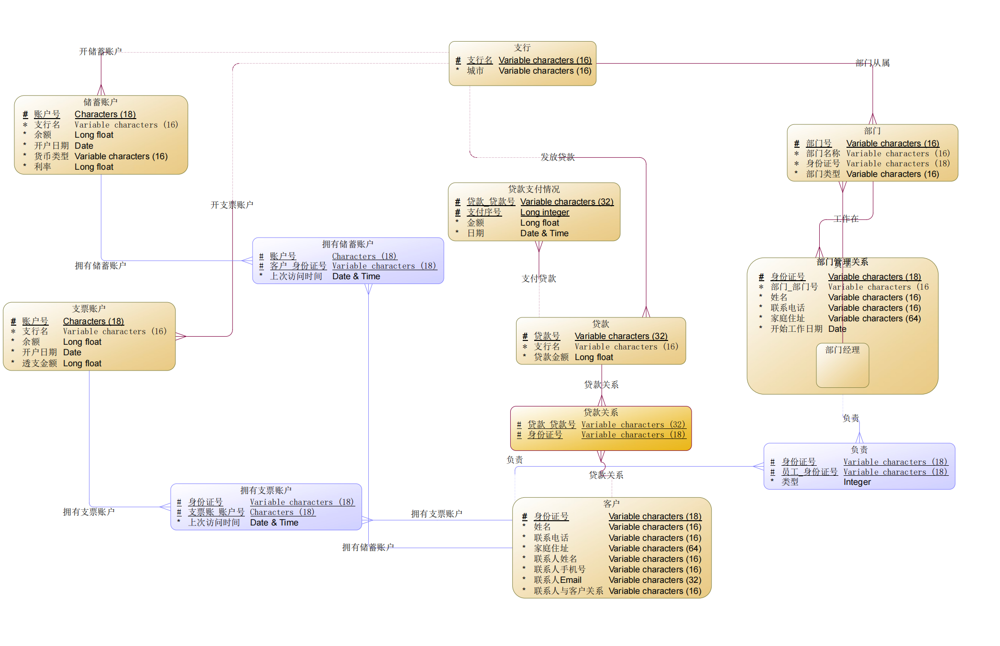
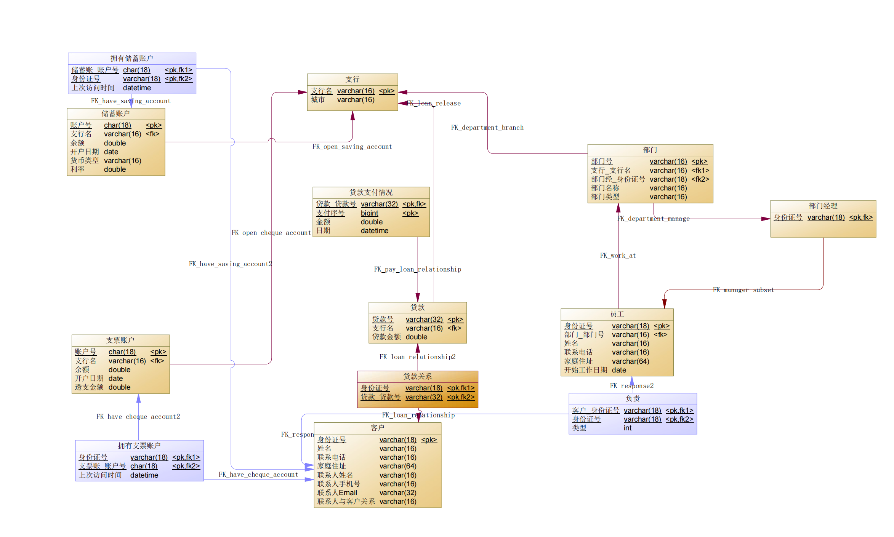

# 银行业务管理系统数据库设计

学号：PB20111623 

姓名：马子睿

## 1. 概念模型设计

### 1.1 实体设计

* 支行：由**支行名、城市**组成
  * 理由：支行是可以用**名字**唯一标识的对象，且物理存在
* 部门：由**部门号、部门名称、部门类型**组成
  * 理由：部门是可以用**部门号**唯一标识的对象，且物理存在
* 员工：由**身份证号、姓名、联系电话、家庭住址、开始工作日期**组成
  * 理由：员工是可以用**身份证号**唯一标识的对象，且物理存在
* 部门经理：是**员工的子类**，没有新的属性
  * 理由：部门经理依然是可以用**身份证号**唯一标识的对象，而且物理存在。在这个需求中至关重要
* 客户：由**身份证号、姓名、联系电话、家庭住址、联系人姓名、联系人手机号、联系人Email、联系人与客户关系**组成
  * 客户是可以用**身份证号**唯一标识的对象，且物理存在。这里的联系人也可以单独作一个实体，但没有必要，因为一个客户有且仅有一个联系人，按照**实体尽可能少**的原则，我去除了联系人这个实体
* 储蓄账户：由**账户号、余额、开户日期、货币类型、利率**组成
  * 理由：储蓄账户是可以用**账户号**唯一标识的对象，且代表了抽象概念的实体
* 支票账户：由**账户号、余额、开户日期、货币类型、利率**组成
  * 理由：支票账户是可以用**账户号**唯一标识的对象，且代表了抽象概念的实体。由于后续一家一行只能给一个客户提供一个储蓄账户和支票账户，因此这里将两种账户分开，便于进行这方面的检查
* 贷款：由**贷款号、贷款金额**组成
  * 理由：贷款是可以用**贷款号**唯一标识的对象，且代表了抽象概念的实体
* 贷款支付情况：由**支付序号、金额、日期**组成
  * 理由：贷款支付情况依赖于贷款，可以用**支付序号**唯一标识这笔贷款支付的情况，且代表了抽象概念的实体

### 1.2 联系设计

#### 无属性联系

* **支行——(0, N)——开储蓄账户——(1, 1)——储蓄账户**
  * 支行可以开户多个储蓄账户，但一个储蓄账户必须有且仅有一个对应的支行
* **支行——(0, N)——开支票账户——(1, 1)——支票账户**
  * 支行可以开户多个支票账户，但一个支票账户必须有且仅有一个对应的支行
* **支行——(1, N)——部门从属——(1, 1)——部门**
  * 支行至少有一个部门（光杆银行不太现实），一个部门必须从属且仅从属于一个支行
* **支行——(0, N)——发放贷款——(1, 1)——贷款**
  * 支行可以发放多笔贷款，但每一笔贷款必须从属且仅从属于一个支行
* **员工——(1, 1)——工作于——(1, n)——部门**
  * 员工只能工作在一个部门，一个部门也至少有一个员工（只有领导显然不现实）
* **部门经理——(1, 1)——部门管理——(1, 1)——部门**
  * 部门经理也属于员工，只能管理一个部门，同时一个部门必须有一个部门经理
* **客户——(0, n)——贷款关系——(1, n)——贷款**
  * 客户可以有多笔贷款，但一笔贷款必须至少有一个申请的客户
* **贷款——(0, n)——支付贷款——(1, 1)——贷款支付情况**
  * 一笔贷款可以有多个支付情况，但每一个支付情况必须对应一笔贷款

#### 有属性联系

* **员工——(0, n)——负责（类型）——(0, n)——客户**

  * 一个员工可以是贷款负责人也可以是银行账户负责人，同时一个员工可以负责多个客户，一个客户也可以被多个员工负责
* **客户——(0, n)——拥有支票账户（上次访问时间）——(1, n)——支票账户**
  * 一个客户可以有多个支票账户，但一个支票账户至少要对应一个客户
* **客户——(0, n)——拥有储蓄账户（上次访问时间）——(1, n)——储蓄账户**
  * 一个客户可以有多个储蓄账户，但一个储蓄账户至少要对应一个客户
  * 对于每个客户只能在一个支行开一个储蓄账户的问题，可以在开户时使用过程化SQL做检查

### 1.3 Power Designer的ER图

## 2. 概念模型到逻辑模型的转换

### 2.1 实体转换

* 先进行简单的实体转换：

  1. 支行（<u>支行名</u>，城市）

  2. 部门（<u>部门号</u>，部门名称，部门类型）
  3. 员工（<u>身份证号</u>，姓名，联系电话，家庭住址，开始工作日期）
  4. 部门经理（）
  5. 客户（<u>身份证号</u>，姓名，联系电话，家庭住址，联系人姓名，联系人手机号，联系人Email，联系人与客户关系）
  6. 贷款（<u>贷款号</u>，贷款金额）
  7. 贷款支付情况（<u>支付序号</u>，金额，日期）
  8. 支票账户（<u>账户号</u>，余额，开户日期，透支金额）
  9. 储蓄账户（<u>账户号</u>，余额，开户日期，货币类型，利率）

* 考虑子类**部门经理**，加入父类表示作为主码：

  4. 部门经理（<u>身份证号</u>）

### 2.2 联系转换

* **支行——(0, N)——开储蓄账户——(1, 1)——储蓄账户**

  9. 储蓄账户（<u>账户号</u>，支行名，余额，开户日期，货币类型，利率）

* **支行——(0, N)——开支票账户——(1, 1)——支票账户**

  8. 支票账户（<u>账户号</u>，支行名，余额，开户日期，透支金额）

* **支行——(1, N)——部门从属——(1, 1)——部门**

  2. 部门（<u>部门号</u>，部门名称，部门类型，支行名）

* **支行——(0, N)——发放贷款——(1, 1)——贷款**

  6. 贷款（<u>贷款号</u>，支行名，贷款金额）

* **员工——(1, 1)——工作于——(1, n)——部门**

  3. 员工（<u>身份证号</u>，部门号，姓名，联系电话，家庭住址，开始工作日期）

* **部门经理——(1, 1)——部门管理——(1, 1)——部门**

  2. 部门（<u>部门号</u>，部门名称，部门类型，支行名，身份证号）

* **客户——(0, n)——贷款关系——(1, n)——贷款**

  * 新建关系模式“贷款关系”

  10. 贷款关系（<u>身份证号</u>，<u>贷款号</u>）

* **贷款——(0, n)——支付贷款——(1, 1)——贷款支付情况**

  * 这里贷款支付情况依赖于贷款，因此要更新主码：

  7. 贷款支付情况（<u>支付序号</u>，<u>贷款号</u>，金额，日期）

* **员工——(0, n)——负责（类型）——(0, n)——客户**

  11. 负责（<u>客户身份证号</u>，<u>员工身份证号</u>，类型）

* **客户——(0, n)——拥有支票账户（上次访问时间）——(1, n)——支票账户**

  12. 拥有支票账户（<u>身份证号</u>，<u>账户号</u>，上次访问时间）

* **客户——(0, n)——拥有储蓄账户（上次访问时间）——(1, n)——储蓄账户**

  13. 拥有储蓄账户（<u>身份证号</u>，<u>账户号</u>，上次访问时间）

### 2.3 最终的关系模式

1. 支行（<u>支行名</u>，城市）

2. 部门（<u>部门号</u>，部门名称，部门类型，支行名，身份证号）
3. 员工（<u>身份证号</u>，部门号，姓名，联系电话，家庭住址，开始工作日期）
4. 部门经理（）
5. 客户（<u>身份证号</u>，姓名，联系电话，家庭住址，联系人姓名，联系人手机号，联系人Email，联系人与客户关系）
6. 贷款（<u>贷款号</u>，支行名，贷款金额）
7. 贷款支付情况（<u>支付序号</u>，<u>贷款号</u>，金额，日期）
8. 支票账户（<u>账户号</u>，支行名，余额，开户日期，透支金额）
9. 储蓄账户（<u>账户号</u>，支行名，余额，开户日期，货币类型，利率）
10. 贷款关系（<u>身份证号</u>，<u>贷款号</u>）
11. 负责（<u>客户身份证号</u>，<u>员工身份证号</u>，类型）
12. 拥有支票账户（<u>身份证号</u>，<u>账户号</u>，上次访问时间）
13. 拥有储蓄账户（<u>身份证号</u>，<u>账户号</u>，上次访问时间）

## 3. MySQL数据库结构实现

### 3.1 Power Designer的PDM图

### 3.2 数据库表定义

1. **支行表**

| 列名 | 中文含义   | 类型（长度） | 允许为空 | 是否主键 | 是否外键 |
| ---- | ---------- | ------------ | -------- | -------- | -------- |
| name | 支行名     | varchar(16)  | 否       | 是       | 否       |
| city | 所在城市名 | varchar(16)  | 否       | 否       | 否       |

2. **部门表**

| 列名       | 中文含义         | 类型（长度） | 允许为空 | 是否主键 | 是否外键     |
| ---------- | ---------------- | ------------ | -------- | -------- | ------------ |
| id         | 部门号           | varchar(16)  | 否       | 是       | 否           |
| bra_name   | 所属支行名       | varchar(16)  | 否       | 否       | 支行表name   |
| manager_id | 部门经理身份证号 | varchar(18)  | 否       | 否       | 部门经理表id |
| name       | 部门名称         | varchar(16)  | 否       | 否       | 否           |
| type       | 部门类型         | varchar(16)  | 否       | 否       | 否           |

3. **员工表**

| 列名            | 中文含义     | 类型（长度） | 允许为空 | 是否主键 | 是否外键 |
| --------------- | ------------ | ------------ | -------- | -------- | -------- |
| id              | 员工身份证号 | varchar(18)  | 否       | 是       | 否       |
| dep_id          | 所属部门号   | varchar(16)  | 否       | 否       | 部门表id |
| name            | 员工姓名     | varchar(16)  | 否       | 否       | 否       |
| phonenum        | 联系电话     | varchar(16)  | 否       | 否       | 否       |
| address         | 家庭住址     | varchar(64)  | 否       | 否       | 否       |
| work_start_date | 开始工作时间 | date         | 否       | 否       | 否       |

4. **部门经理表**

| 列名 | 中文含义         | 类型（长度） | 允许为空 | 是否主键 | 是否外键   |
| ---- | ---------------- | ------------ | -------- | -------- | ---------- |
| id   | 部门经理身份证号 | varchar(18)  | 否       | 是       | 员工表name |

5. **客户表**

| 列名             | 中文含义         | 类型（长度） | 允许为空 | 是否主键 | 是否外键 |
| ---------------- | ---------------- | ------------ | -------- | -------- | -------- |
| id               | 客户身份证号     | char(18)     | 否       | 是       | 否       |
| name             | 客户姓名         | varchar(16)  | 否       | 否       | 否       |
| phonenum         | 联系电话         | varchar(16)  | 否       | 否       | 否       |
| address          | 家庭住址         | varchar(64)  | 否       | 否       | 否       |
| contact_id       | 联系人身份证号   | varchar(18)  | 否       | 否       | 否       |
| contact_phonenum | 联系人手机号     | varchar(16)  | 否       | 否       | 否       |
| contact_email    | 联系人电子邮件   | varchar(32)  | 否       | 否       | 否       |
| contact_relation | 联系人与客户关系 | varchar(16)  | 否       | 否       | 否       |

6. **贷款表**

| 列名     | 中文含义   | 类型（长度） | 允许为空 | 是否主键 | 是否外键   |
| -------- | ---------- | ------------ | -------- | -------- | ---------- |
| id       | 贷款号     | varchar(32)  | 否       | 是       | 否         |
| bra_name | 所属支行名 | varchar(16)  | 否       | 否       | 支行表name |
| amount   | 贷款金额   | double       | 否       | 否       | 否         |

7. **贷款支付情况表**

| 列名     | 中文含义 | 类型（长度） | 允许为空 | 是否主键 | 是否外键 |
| -------- | -------- | ------------ | -------- | -------- | -------- |
| loan_id  | 贷款号   | varchar(32)  | 否       | 是       | 贷款表id |
| id       | 支付序号 | bigint       | 否       | 是       | 否       |
| amount   | 金额     | double       | 否       | 否       | 否       |
| pay_date | 日期     | datetime     | 否       | 否       | 否       |

8. **支票账户表**

| 列名              | 中文含义   | 类型（长度） | 允许为空 | 是否主键 | 是否外键   |
| ----------------- | ---------- | ------------ | -------- | -------- | ---------- |
| id                | 账户号     | char(18)     | 否       | 是       | 否         |
| bra_name          | 所属支行名 | varchar(16)  | 否       | 否       | 支行表name |
| balance           | 余额       | double       | 否       | 否       | 否         |
| account_open_date | 开户日期   | date         | 否       | 否       | 否         |
| overload          | 透支金额   | double       | 否       | 否       | 否         |

9. **储蓄账户表**

| 列名              | 中文含义   | 类型（长度） | 允许为空 | 是否主键 | 是否外键   |
| ----------------- | ---------- | ------------ | -------- | -------- | ---------- |
| id                | 账户号     | char(18)     | 否       | 是       | 否         |
| bra_name          | 所属支行名 | varchar(16)  | 否       | 否       | 支行表name |
| balance           | 余额       | double       | 否       | 否       | 否         |
| account_open_date | 开户日期   | date         | 否       | 否       | 否         |
| currency_type     | 货币类型   | varchar(16)  | 否       | 否       | 否         |
| ratio             | 利率       | double       | 否       | 否       | 否         |

10. **贷款关系表**

| 列名    | 中文含义     | 类型（长度） | 允许为空 | 是否主键 | 是否外键 |
| ------- | ------------ | ------------ | -------- | -------- | -------- |
| id      | 客户身份证号 | varchar(18)  | 否       | 是       | 客户表id |
| loan_id | 贷款号       | varchar(32)  | 否       | 是       | 贷款表id |

11. **负责表**

| 列名     | 中文含义     | 类型（长度） | 允许为空 | 是否主键 | 是否外键 |
| -------- | ------------ | ------------ | -------- | -------- | -------- |
| cus_id   | 客户身份证号 | varchar(18)  | 否       | 是       | 客户表id |
| staff_id | 员工身份证号 | varchar(18)  | 否       | 是       | 员工表id |
| type     | 类型         | int          | 否       | 否       | 否       |

12. **拥有支票账户表**

| 列名            | 中文含义     | 类型（长度） | 允许为空 | 是否主键 | 是否外键     |
| --------------- | ------------ | ------------ | -------- | -------- | ------------ |
| cus_id          | 客户身份证号 | varchar(18)  | 否       | 是       | 客户表id     |
| che_id          | 支票账户号   | varchar(18)  | 否       | 是       | 支票账户表id |
| last_visit_time | 上次访问时间 | datetime     | 否       | 否       | 否           |

13. **拥有储蓄账户表**

| 列名            | 中文含义     | 类型（长度） | 允许为空 | 是否主键 | 是否外键     |
| --------------- | ------------ | ------------ | -------- | -------- | ------------ |
| cus_id          | 客户身份证号 | varchar(18)  | 否       | 是       | 客户表id     |
| sav_id          | 储蓄账户号   | varchar(18)  | 否       | 是       | 储蓄账户表id |
| last_visit_time | 上次访问时间 | datetime     | 否       | 否       | 否           |

## 4. 总结和体会

* Power Design确实是非常强大的数据库设计软件，功能非常的齐全，有待探索
* 通过wanings可以找到许多优化设计的方法，比如合并主体
* 设计数据库一定要精确地划分好实体和关系，最开始我在拥有支票账户的设计上有疑惑，和同学讨论后终于茅塞顿开
* 希望后面可以在linux上有替代的工具！
