# 数字图像处理与分析 实验报告

## 实验一 图像几何变换

### 图像的平移

* 使用translate函数来生成一个基于输入位移大小的方式：

  ```matlab
  se = translate(strel(1), [ud, lr]);
  ```

* 使用imdilate函数来对图像作变换：

  ```matlab
  img_mv = imdilate(img_org, se);
  ```

* 实验结果如下：
  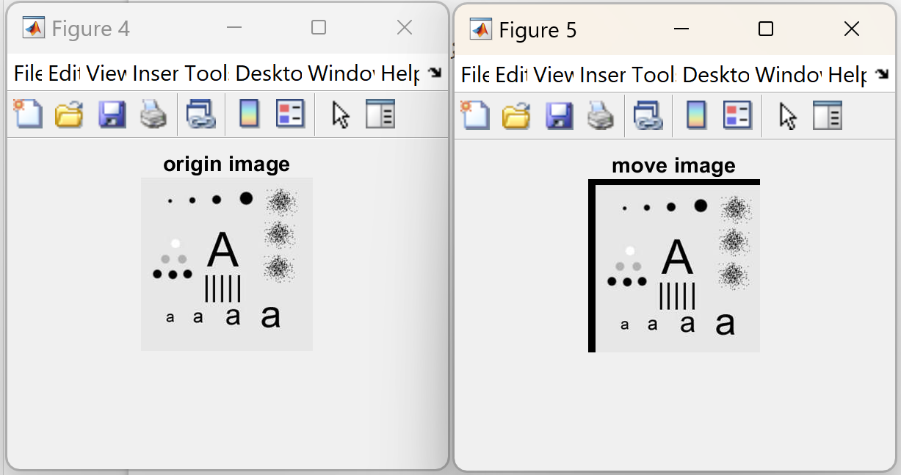

  图为水平移动10个单位，垂直移动8个单位的变换

### 图像的旋转

* 使用imrotate实现最近邻插值旋转：

  ```matlab
  img_near = imrotate(img_org, angle, 'nearest', 'crop');
  ```

* 使用imrotate实现双线性插值旋转：

  ```matlab
  img_bil = imrotate(img_org, angle, 'bilinear', 'crop');
  ```

* 实验结果如下：

  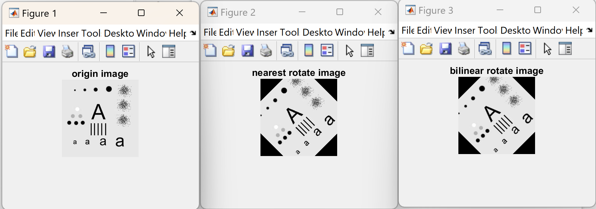

  图为旋转45度后的结果

### 图像的缩放

* 使用imresize实现最近邻插值缩放

  ```matlab
  img_near = imresize(img_org, times, 'nearest');
  ```

* 使用imresize实现双线性插值缩放

  ```matlab
  img_bil = imresize(img_org, times, 'bilinear');
  ```

* 实验结果如下：

  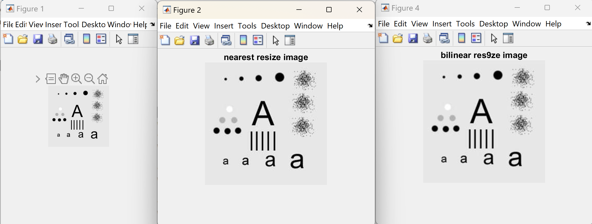

  图为将图片长宽都变为2倍后的结果

### 图像失真几何校正

* 先通过cpselect设置控制点：

  ```matlab
  [mp, fp] = cpselect(ab2, ab1, 'Wait', true);
  ```

  在这个界面中可以选择对应的控制点

* 再使用fitgeotrans函数生成变换矩阵，并用imwarp进行修正：

  ```matlab
  tform = fitgeotrans(mp, fp, 'projective');
  correct = imwarp(ab2, tform, 'OutputView', imref2d(size(ab2)));
  ```

* 实验结果如下：

  选择如下四个点：

  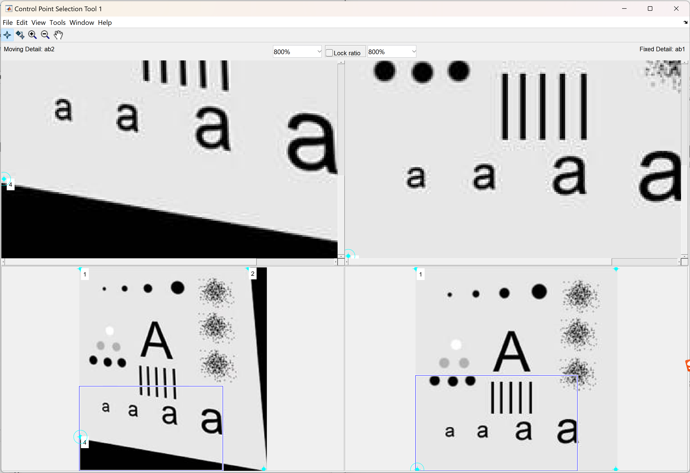

  修正结果：

  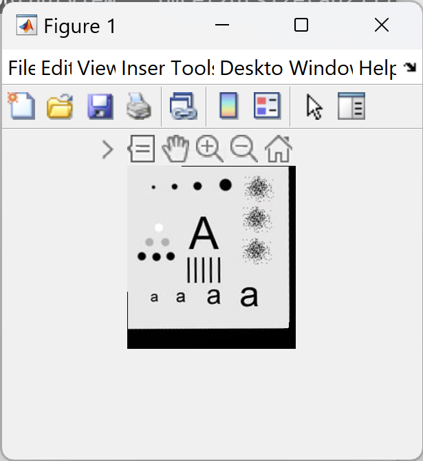

## 实验二 图像点处理增强

### 灰度线性变换

* 使用matlab自带的乘法和加法重载，就可以完成灰度线性变换：
  ```matlab
  transformed = original * k + b;
  ```

* 实验结果如下：

  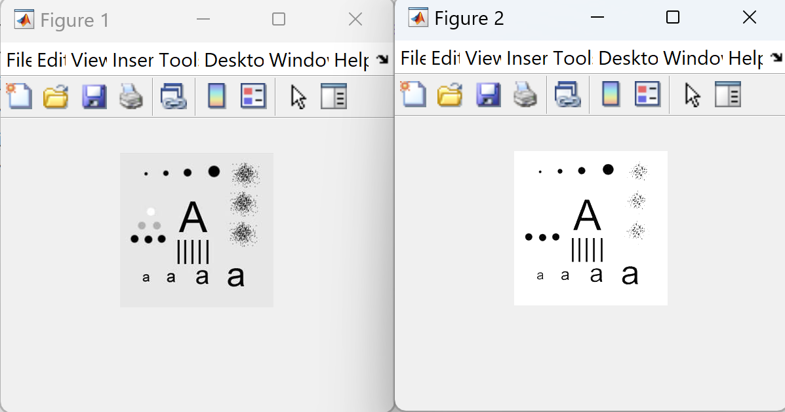
  
  这里设置斜率为2，截距为2，可以看到灰度增强效果

### 灰度拉伸

* 根据灰度拉伸的变换的公式，可以通过循环完成灰度变换。下面的这个双重循环对每一个像素点进行分段变换：

  ```matlab
  for i = 1 : h
      for j = 1 : w
          if A1(i, j) <= x1
              A2(i, j) = (y1 / x1) * A1(i, j);
          elseif A1(i,j) < x2
              A2(i, j) = (y2 - y1) / (x2 - x1) * (A1(i, j) - x1) + y1;
          else 
              A2(i, j) = (255 - y2)/(255 - x2) * (A1(i,j) - x2) + y2;
          end
      end
  end
  ```

* 实验结果如下：

  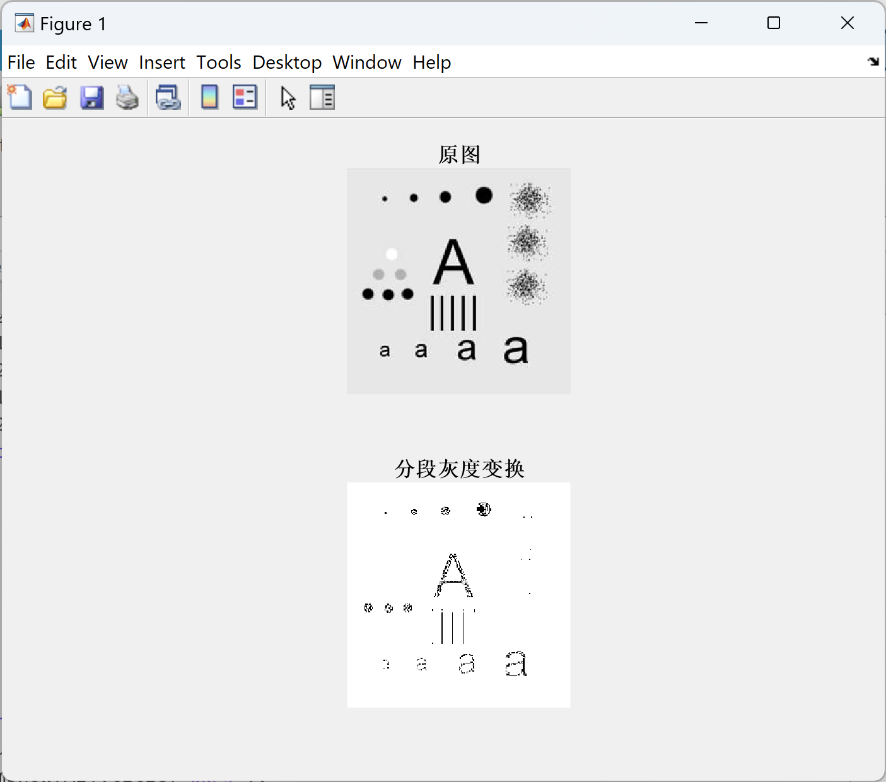
  
  这里选取了（0,0）和（128,128）两个点，整个分段灰度变换的效果比较明显。

### 灰度直方图

* matlab显示灰度直方图的方法是一个简单的函数调用：

  ```matlab
  gray_range = [low, high];
  num_bins = diff(gray_range) + 1;
  counts = histcounts(pic, num_bins, 'BinLimits', gray_range); 
  ```

  通过histcounts来计算直方图

* 实验结果如下：

  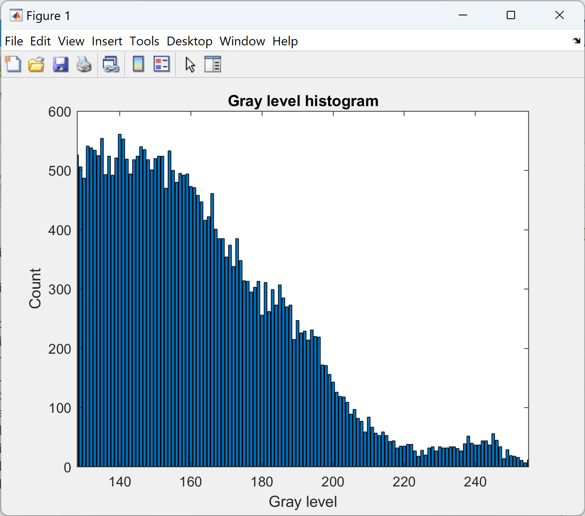
  
  图为[128, 255]的灰度直方图

### 直方图均衡

* 显示直方图依然比较简单的方法：
  ```matlab
  histogram(pic);
  ```

* 可以使用histeq函数进行直方图均衡，并显示直方图后的图像：

  ```matlab
  pic2 = histeq(pic);
  ```

* 通过给histeq传递更多参数，来将其进行规定化：

  ```matlab
  pic3 = histeq(pic, normpdf((0:1:255), 128, 50));
  ```

* 实验结果如下：

  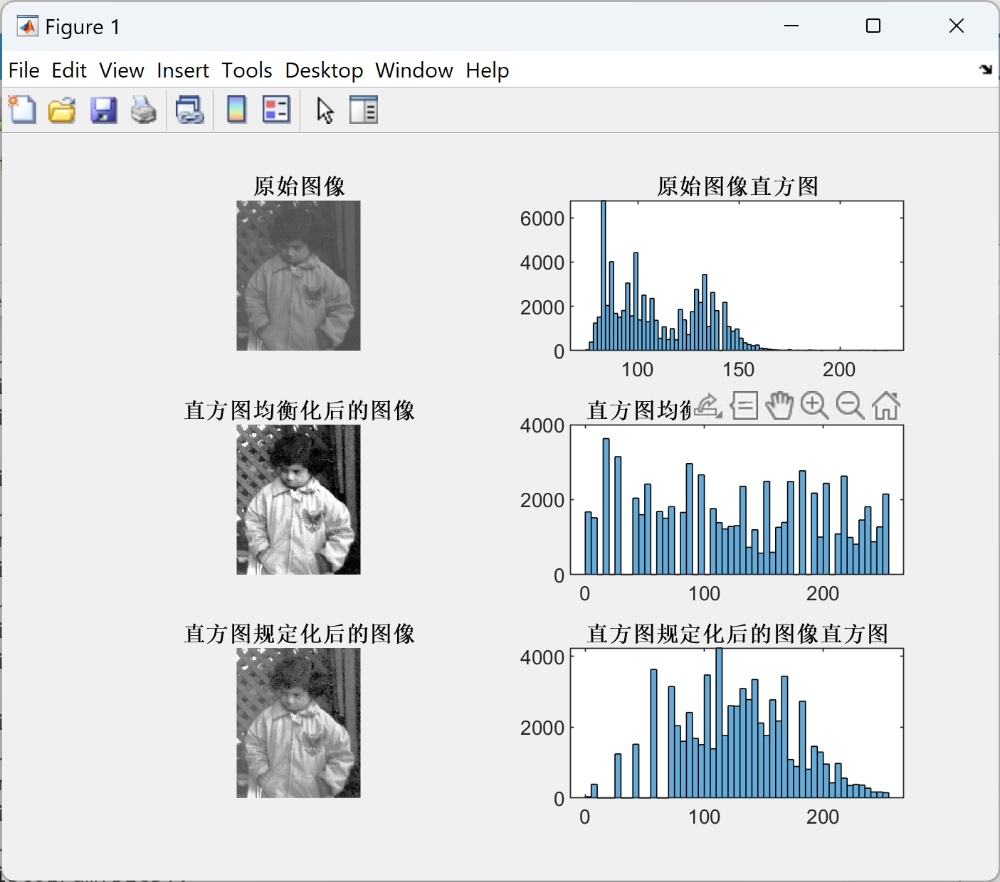

## 实验三 图像空间域滤波增强

### 均值滤波器

* 使用imnoise分别为图像加入3%椒盐噪声、高斯噪声、随机噪声：

  ```matlab
  % 3%椒盐噪声
  img_salt = imnoise(img, 'salt & pepper', 0.03);
  % 3%高斯噪声
  img_gaussian = imnoise(img, 'gaussian', 0, 0.03);
  % 3%随机噪声
  img_random = imnoise(img, 'speckle', 0.03);
  ```

* 使用imfilter实现均值滤波器去除图像中的噪声（选 3x3 窗口）：
  ```matlab
  img_salt_mean = imfilter(img_salt, fspecial('average', 3));
  img_gaussian_mean = imfilter(img_gaussian, fspecial('average', 3));
  img_random_mean = imfilter(img_random, fspecial('average', 3));
  ```

* 实验结果如下：

  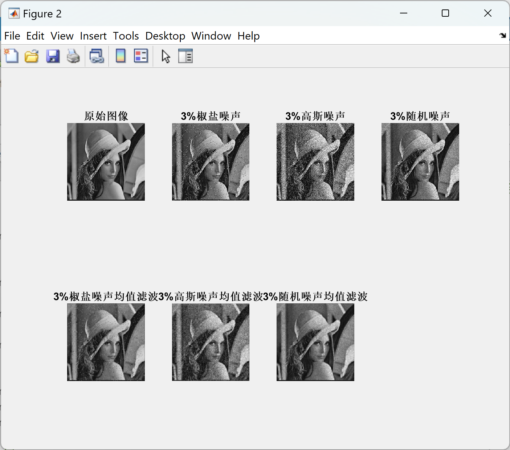

### 超限邻域平均法

* 使用overlimit函数实现了超限邻域平均法：一旦某一点的像素和邻域均值的差值超过阈值，那么就会把这个点的像素变为邻域均值：

  ```matlab
  function img = overlimit(img, threshold)
      [m, n] = size(img);
      for i = 2:m-1
          for j = 2:n-1
              if abs(img(i, j) - mean(mean(img(i-1:i+1, j-1:j+1)))) > threshold
                  img(i, j) = mean(mean(img(i-1:i+1, j-1:j+1)));
              end
          end
      end
  end
  ```

* 调用这个函数，就可以得到对于不同噪声图像的去噪效果：

  ```matlab
  img_salt_3 = overlimit(img_salt, 50);
  img_gaussian_3 = overlimit(img_gaussian, 50);
  img_random_3 = overlimit(img_random, 50);
  ```

* 实验结果如下：

  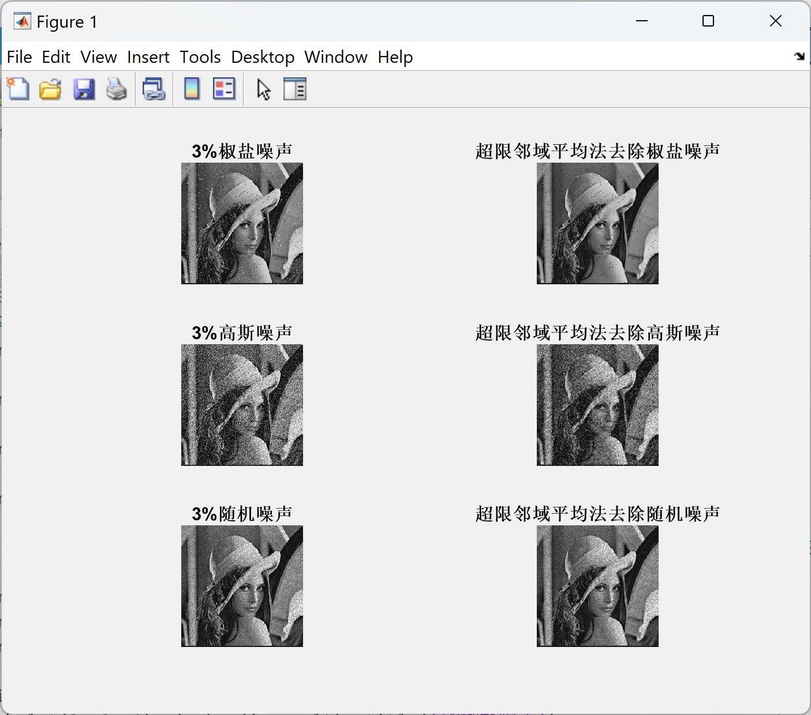

### 中值滤波器

* 使用medfilt2函数来完成3x3窗口中值滤波：
  ```matlab
  img_salt_med = medfilt2(img_salt, [3, 3]);
  img_gaussian_med = medfilt2(img_gaussian, [3, 3]);
  img_random_med = medfilt2(img_random, [3, 3]);
  ```

* 实验结果如下：

  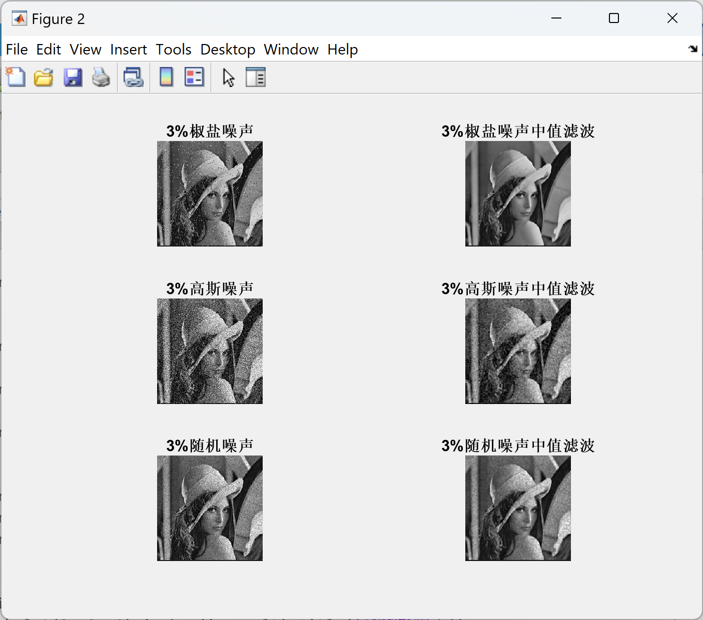

### 超限中值滤波器

* 超限中值滤波器和超限邻域平均法一样，都需要使用额外的函数来实现：

  * 对每一个窗口，对其中的像素进行排序
  * 如果出现某个像素大于中位数的情况，且这个像素大于阈值，那么就需要把像素改为中值

  实现方法如下：

  ```matlab
  function img = adpmedian(img, winsize, thres)
      [m, n] = size(img);
      img = double(img);
      bound = ceil(winsize/2);
      for i = 1:m
          for j = 1:n
              % 3*3窗口
              if i > bound && i < m-bound+1 && j > bound && j < bound+1
                  window = img(i-bound:i+bound, j-bound:j+bound);
                  % 排序
                  window = sort(window(:));
                  % 中值
                  median = window(ceil(length(window)/2));
                  % 当前像素值
                  pixel = img(i, j);
                  % 当前像素值与中值的差
                  diff = abs(pixel - median);
                  if diff > thres
                      img(i, j) = median;
                  end
              end
          end
      end
      img = uint8(img);
  end
  ```

* 实验结果如下：

  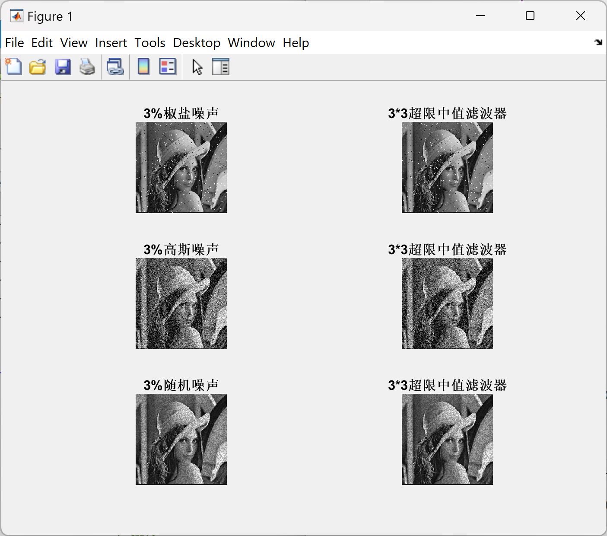

### 四种滤波的比较

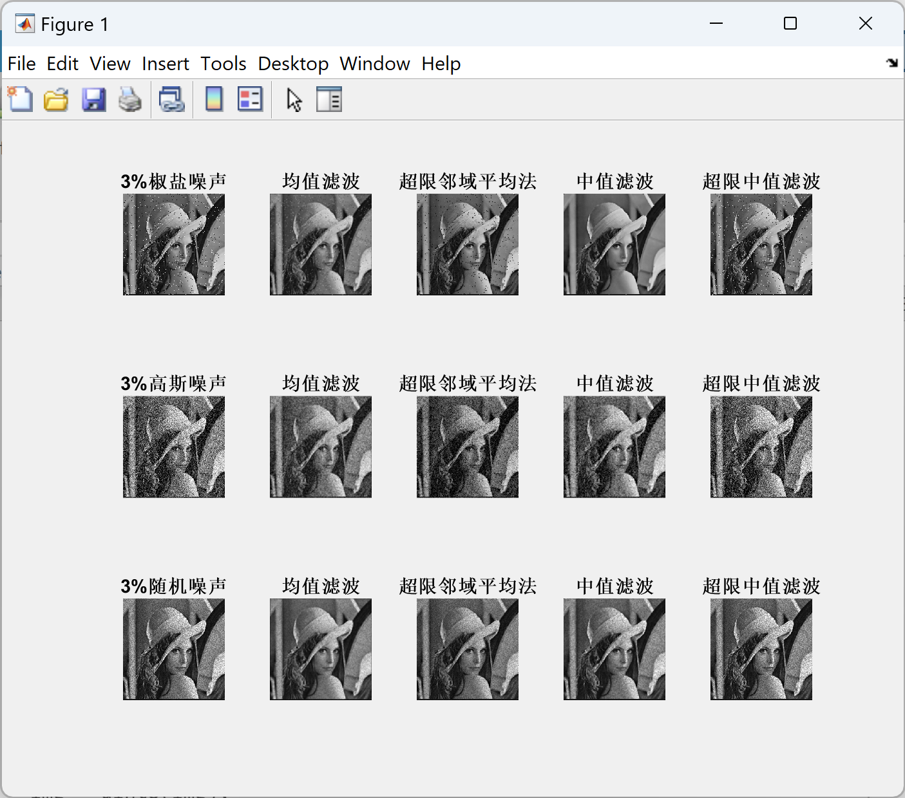

可以看到，在椒盐噪声下，中值滤波对边缘处理较好，而在随机噪声下，均值滤波对边缘处理较好，而在高斯噪声下，所有滤波法的效果都不太好。

### 边缘检测

* 边缘检测需要对两张图片使用edge函数，通过不同的参数来规定算子：

  * Roberts算子：

    ```matlab
    lena_roberts = edge(lena, 'Roberts');
    blood_roberts = edge(blood, 'Roberts');
    ```

  * Sobel算子：

    ```matlab
    lena_sobel = edge(lena, 'Sobel');
    blood_sobel = edge(blood, 'Sobel');
    ```

  * Prewitt算子：

    ```matlab
    lena_prewitt = edge(lena, 'Prewitt');
    blood_prewitt = edge(blood, 'Prewitt');
    ```

  * 4邻域拉普拉斯算子：

    ```matlab
    lena_laplacian1 = edge(lena, 'log');
    blood_laplacian1 = edge(blood, 'log');
    ```

  * 8邻域拉普拉斯算子：

    ```matlab
    lena_laplacian2 = edge(lena, 'log', 0, 1);
    blood_laplacian2 = edge(blood, 'log', 0, 1);
    ```

  * Canny 算子：

    ```matlab
    lena_canny = edge(lena, 'Canny');
    blood_canny = edge(blood, 'Canny');
    ```

* 实验结果如下：

  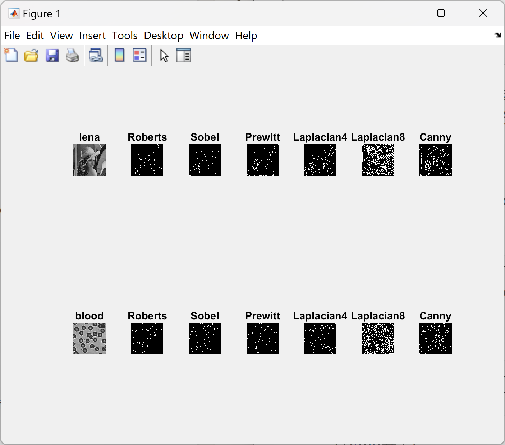

## 实验四 图像变换及频域滤波增强

### 傅里叶变换

* 二维傅里叶变换：

  * 首先需要用fft2函数进行二位傅里叶变换：

    ```matlab
    F1 = fft2(rect1);
    F2 = fft2(rect2);
    ```

  * 再将低频移到中心点

    ```matlab
    F1_shift = log(abs(fftshift(F1))+1);
    F2_shift = log(abs(fftshift(F2))+1);
    ```

* 傅里叶幅度反变换：

  * 使用ifft传入图像幅度进行变换：

    ```matlab
    IF1_abs = uint8(ifft2(abs(F1)));
    IF2_abs = uint8(ifft2(abs(F2)));
    ```

* 傅里叶相位反变换：

  * 获取两张图片傅里叶变换的相位：

    ```matlab
    phase1 = angle(F1);
    phase2 = angle(F2);
    ```

  * 对图像反变换：

    ```matlab
    IF1_angle = uint8(abs(ifft2(10000*exp(1i*phase1))));
    IF2_angle = uint8(abs(ifft2(10000*exp(1i*phase2))));
    ```

* 共轭傅里叶反变换：

  * 获取两张图片傅里叶变换的共轭：

    ```matlab
    conjF1 = conj(F1);
    conjF2 = conj(F2);
    ```

  * 反变换得到图像：

    ```matlab
    IF1_conj = ifft2(conjF1);
    IF2_conj = ifft2(conjF2);
    ```

* 实验结果如下：

  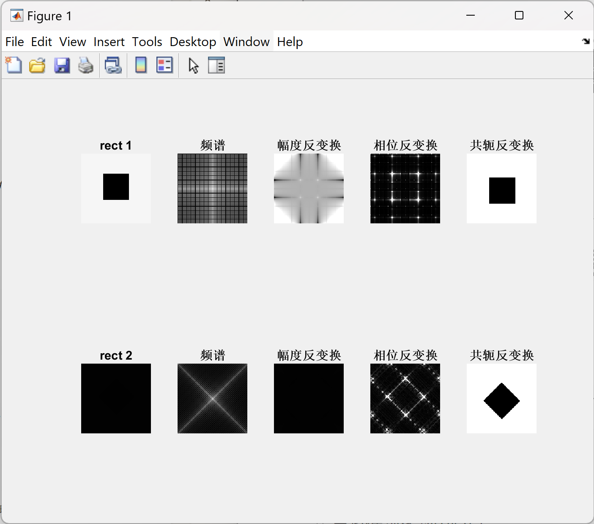

### 低通滤波器

* 实验中要求实现三种低通滤波器，我这里采用了两个函数进行实现：

  * 通过不同的参数选择不同的滤波器算子：

    ```matlab
    function H = lpfilter(type, M, N, D0, n)
        
        % Initialize filter
        % Compute distance from center for each pixel
        % D = zeros(M, N);
        [U,V] = meshgrid(-N/2:N/2-1,-M/2:M/2-1);%构建坐标
        D = hypot(U,V);%计算中心偏移距离
        
        % Generate filter based on type
        switch type
            case 'ideal'
                H = D <= D0;
            case 'btw'
                if n == 0
                    error('The order of Butterworth filter cannot be 0.');
                end
                H = 1./(1 + (D./D0).^(2*n));
            case 'gaussian'
                H = exp(-(D./D0).^n);
            otherwise
                error('Unsupported filter type.');
        end
        
    end
    ```

  * 通过算子和傅里叶变换进行低通滤波：

    ```matlab
    function output = freqfilter(img, H)
        
        % Compute the Fourier transform of the input image
        F = fft2(img);
        
        % Shift the zero-frequency component to the center of the spectrum
        F = fftshift(F);
        
        % Apply the frequency domain filter to the spectrum
        G = F .* H;
        
        % Shift the zero-frequency component back to the top-left corner
        G = ifftshift(G);
        
        % Compute the inverse Fourier transform to obtain the filtered image
        output = abs(ifft2(G));
        
    end
    ```

    首先进行傅里叶变换并移位，再将算子作用于变换结果后，反变换移位后再进行反变换，即可得到最后的结果：

* 实验结果如下：

  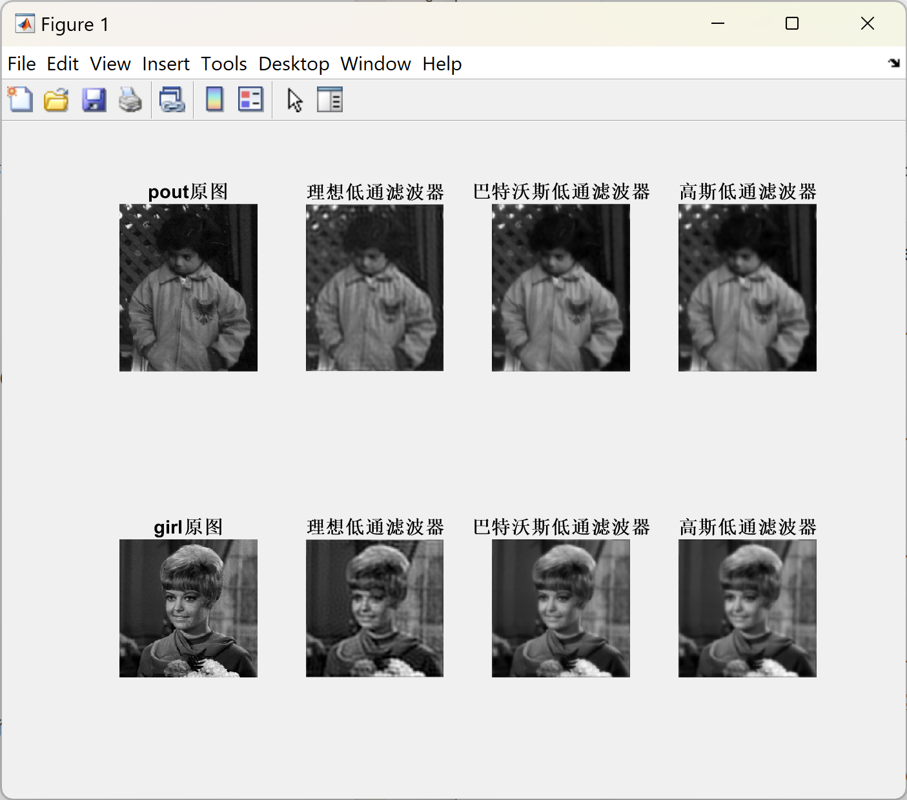

### 低通滤波器去噪

* 调用前一题的函数，对加了噪声的图片进行低通滤波：

  * 理想低通滤波器：

    ```matlab
    D0 = 50; % 截止频率
    H = lpfilter('ideal', size(noisy_girl_sp,1), size(noisy_girl_sp,2), D0);
    lp_noisy_girl_sp = freqfilter(double(noisy_girl_sp), H);
    H = lpfilter('ideal', size(noisy_girl_gauss,1), size(noisy_girl_gauss,2), D0);
    lp_noisy_girl_gauss = freqfilter(double(noisy_girl_gauss), H);
    ```

  * 巴特沃斯低通滤波器：

    ```matlab
    D0 = 50; % 截止频率
    H = lpfilter('ideal', size(noisy_girl_sp,1), size(noisy_girl_sp,2), D0);
    lp_noisy_girl_sp = freqfilter(double(noisy_girl_sp), H);
    H = lpfilter('ideal', size(noisy_girl_gauss,1), size(noisy_girl_gauss,2), D0);
    lp_noisy_girl_gauss = freqfilter(double(noisy_girl_gauss), H);
    ```

  * 高斯低通滤波器：

    ```matlab
    D0 = 50; % 截止频率
    n = 1; % 阶数
    H = lpfilter('btw', size(noisy_girl_sp,1), size(noisy_girl_sp,2), D0, n);
    lp_noisy_girl_sp_btw = freqfilter(double(noisy_girl_sp), H);
    H = lpfilter('btw', size(noisy_girl_gauss,1), size(noisy_girl_gauss,2), D0, n);
    lp_noisy_girl_gauss_btw = freqfilter(double(noisy_girl_gauss), H);
    ```

* 实验结果如下：

  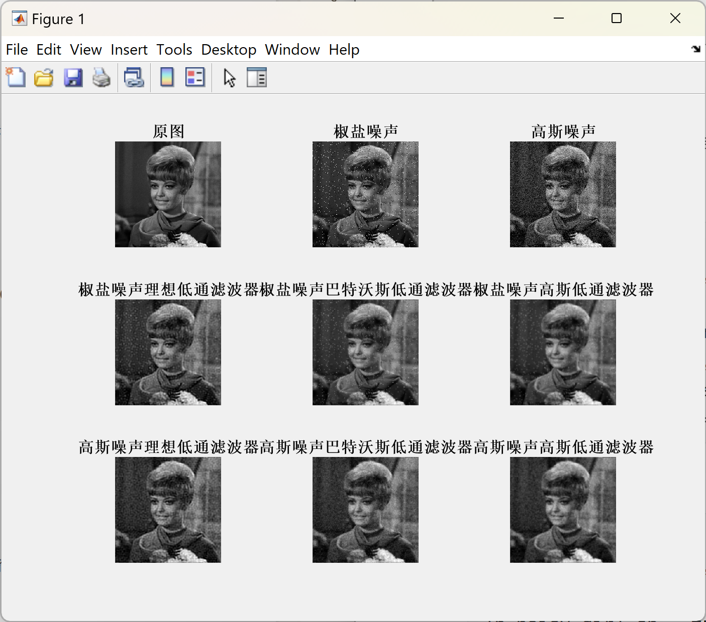

### 高通滤波器

* 类似于低通滤波器，使用一个函数计算算子，再使用一个函数进行变换：

  * 计算高通滤波算子：

    ```matlab
    function H = lpfilter(type, M, N, D0, n)
        [U,V] = meshgrid(-N/2:N/2-1,-M/2:M/2-1);
        D = hypot(U,V);
    
        % 构造滤波器
        switch type
            case 'ideal'
                H = D > D0;
            case 'btw'
                H = 1./ (1 + (D0./D).^(2*n));
            case 'gaussian'
                H = exp(-(D0./D).^n);
            otherwise
                error("Unknown filter type.");
        end
    end
    ```

  * 通过算子和傅里叶变换完成高通滤波：

    ```matlab
    function output = freqfilter(img, H)
        % 傅里叶变换
        F = fft2(img);
    
        F = fftshift(F);
    
        % 频域滤波
        G = H .* F;
    
        % 傅里叶反变换
        G = ifftshift(G);
    
        output = ifft2(G);
    
        output = abs(output);
    end
    ```

* 实验结果如下：

  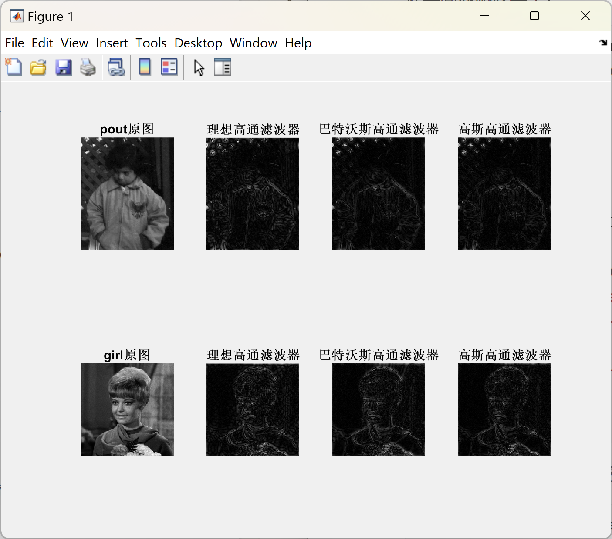
  
  由于这里阈值设置为15，导致了大部分像素都被过滤掉了

### 高频滤波增强与直方图均衡化

* 使用上题中的三种滤波分别进行增强，并进行直方图均衡化，并分别转换顺序：

  * 理想高通滤波：

    ```matlab
    % 理想高通滤波器-直方图
    pout1 = freqfilter(pout, lpfilter('ideal', size(pout, 1), size(pout, 2), D0, n));
    pout1 = histeq(uint8(pout1));
    % 直方图-理想高通滤波器
    pout2 = histeq(pout);
    pout2 = freqfilter(pout2, lpfilter('ideal', size(pout, 1), size(pout, 2), D0, n));
    ```

  * 巴特沃斯高通滤波：

    ```matlab
    % 巴特沃斯高通滤波器-直方图
    pout3 = freqfilter(pout, lpfilter('btw', size(pout, 1), size(pout, 2), D0, n));
    pout3 = histeq(uint8(pout3));
    % 直方图-巴特沃斯高通滤波器
    pout4 = histeq(pout);
    pout4 = freqfilter(pout4, lpfilter('btw', size(pout, 1), size(pout, 2), D0, n));
    ```

  * 高斯高通滤波：

    ```matlab
    % 高斯高通滤波器-直方图
    pout5 = freqfilter(pout, lpfilter('gaussian', size(pout, 1), size(pout, 2), D0, n));
    pout5 = histeq(uint8(pout5));
    % 直方图-高斯高通滤波器
    pout6 = histeq(pout);
    pout6 = freqfilter(pout6, lpfilter('gaussian', size(pout, 1), size(pout, 2), D0, n));
    ```

* 实验结果如下：

  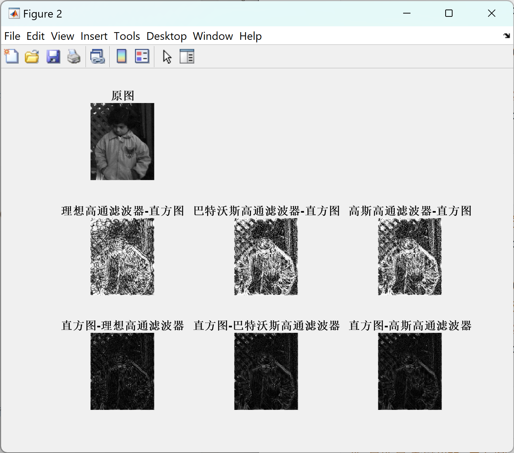

## 实验五 图像恢复与图像分割

### 运动模糊图像

* 使用fspecial函数生成点扩散函数：

  ```matlab
  PSF = fspecial('motion', motion_distance, motion_angle);
  ```

* 使用imfliter进行运动模糊：

  ```matlab
  blurred = imfilter(original, PSF, 'conv', 'circular');
  ```

* 采用deconvwnr实现逆滤波，尝试对运动模糊的图像进行复原

  ```
  deconvolved = deconvwnr(blurred, PSF);

* 采用deconvwnr实现维纳滤波，尝试对运动模糊的图像进行复原

  ```matlab
  SNR = 0.0001;
  deconvolved_wiener = deconvwnr(blurred, PSF, SNR);
  ```

* 对图像添加高斯噪声后，再尝试用两种方法进行恢复：

  ```matlab
  % 采用逆滤波恢复有噪声图像
  deconvolved_noisy = deconvwnr(blurred_noisy, PSF);
  % 采用维纳滤波恢复有噪声图像
  signal_var = var(blurred(:));
  deconvolved_wiener_noisy = deconvwnr(blurred_noisy, PSF, noise_var / signal_var);
  ```

* 实验结果：

  * 运动模糊图像复原：
  
    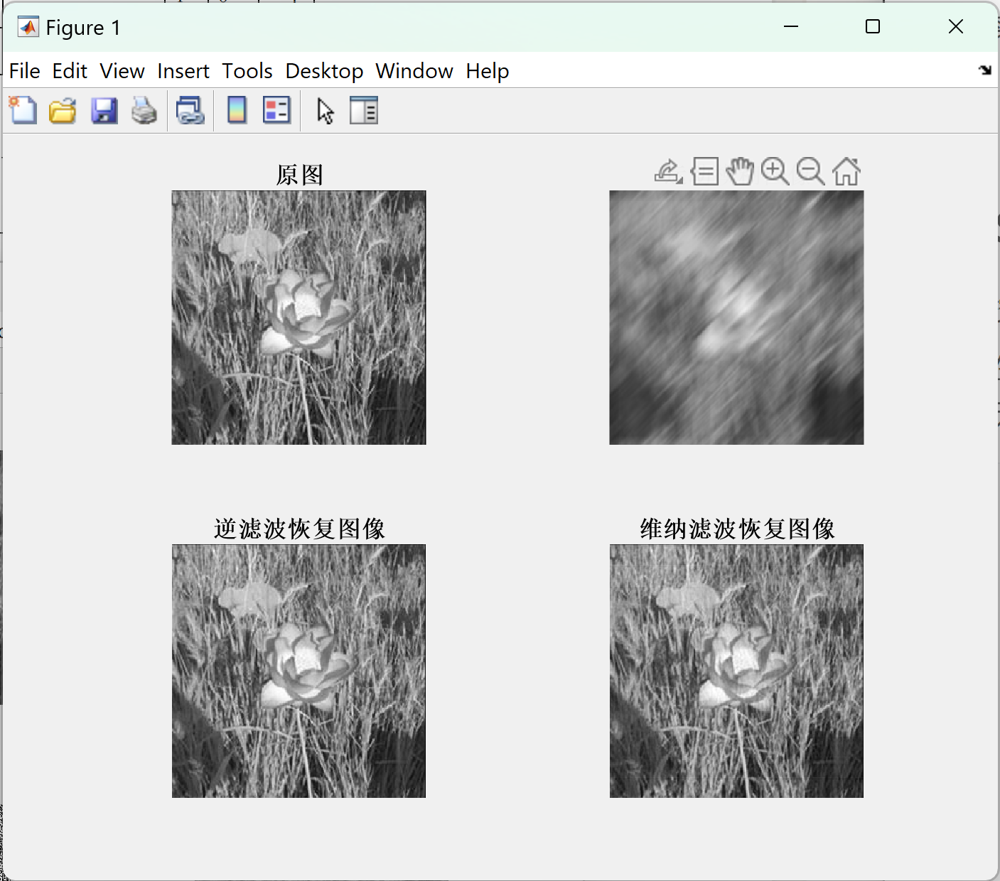
  
  * 运动噪声模糊图像还原：
  
    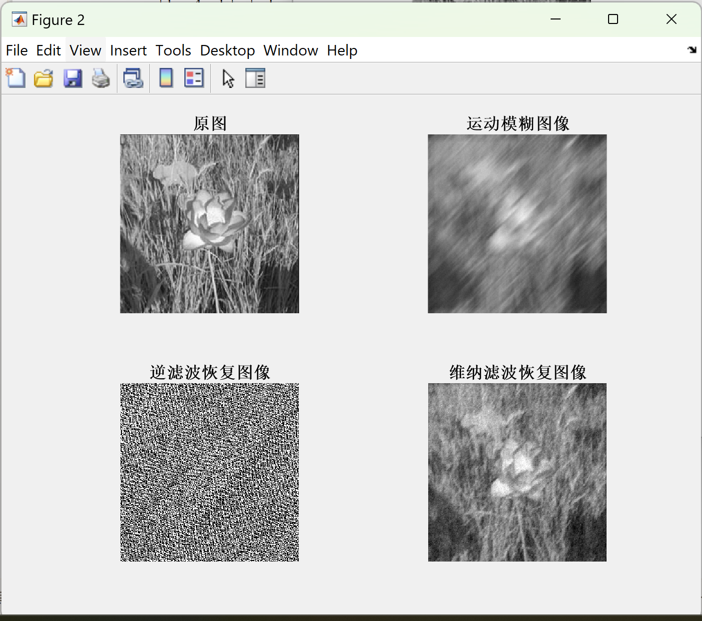

### OTSU阈值分割

* 按照OTSU的方法描述，实现对应的函数代码：

  在我的函数中，由于我们并不关心具体像素分布，而只关注阈值下的概率和，因此只用一遍遍历，通过保存多个$\mu$和$w$的方法来计算$\mu$矩阵和$w$矩阵，从而减少了求解分布函数的遍历次数

  ```matlab
  function T = OSTU(I)
      [r, l] = size(I);
      N = r * l;
      mu = zeros(256);
      w = zeros(256);
      for i = 0 : 255
          mu(i + 1) = sum(I(I == i)) / N;
          w(i + 1) = sum(I(I == i)) / N;
      end
      T = 0;
      max = 0;
      for i = 0 : 255
          sigma = w(i + 1) * (1 - w(i + 1)) * (mu(256) - 2 * mu(i + 1))^2;
          if sigma > max
              max = sigma;
              T = i;
          end
      end
  end
  ```

* 实验结果如下：

  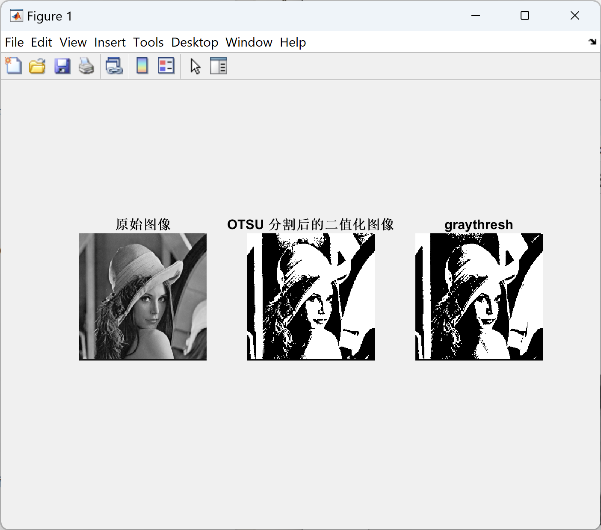
  
  最右侧的图片为自带库函数的效果，可以看到和我的实现效果基本一致

### 用四叉树表达的迭代区域分裂合并算法

* 调用 qtdecomp() 函数对图像进行四叉树分割，并将分割后的结果保存在数组 S 中value_range 参数控制分割的粒度，值越大分割越细。此处设置为 0.35。

  ```matlab
  value_range = .5;
  S = qtdecomp(source,value_range,2);%四叉树分割
  blocks = zeros(256);
  ```

* 通过循环遍历不同的分块大小，产生分块边界。对于每个分块，将其边界像素设置为白色，其余像素设置为黑色，并将其保存在 256x256 的数组 blocks 中。

  ```matlab
  for dim = [64 32 16 8 4 2]
  	blocks_cnt = length(find(S==dim));    
  	if (blocks_cnt > 0)        
          % 全部设置为黑色
          values = repmat(uint8(1),[dim dim blocks_cnt]);
          % 设置边界为白色
          values(2:dim,2:dim,:) = 0;
          % 将分块保存在 blocks 中
          blocks = qtsetblk(blocks,S,dim,values);
    end
  end
  ```

* 在分块边界的基础上，将每个分块进行标记，用不同的整数表示。标记后的结果保存在数组 blocks 中。

   ```matlab
   i = 0;
   for dim = [64 32 16 8 4 2]
       % 从分块中提取块
       [vals,r,c] = qtgetblk(source,S,dim);
       % 如果块不为空，则对块进行标记
       if ~isempty(vals)
           for j = 1:length(r)
               i = i + 1;
               blocks(r(j):r(j)+ dim - 1,c(j):c(j)+ dim - 1) = i;
           end
       end
   end
   ```

* 对于极差较小的分块，将其与周围的分块合并。具体做法是对于每个分块，找到其周围边界像素，并将其与当前分块合并，计算合并后分块的极差，如果小于预设的值 value_range*256，则将其标记与当前分块相同。

  ```matlab
  for j = 1 : i
      bound = boundarymask(blocks == j, 4) & (~(blocks == j));
      % 找到边界像素的位置
      [r,l] = find(bound == 1);
      for k = 1 : size(r,1)
          % 合并
          merge = source((blocks==j) | (blocks==blocks(r(k),l(k))));
          % 计算极差
          if(range(merge(:)) < value_range * 256)
              % 标记
              blocks(blocks == blocks(r(k), l(k))) = j;
          end
      end
  end
  ```

* 根据标记重新分割图像，合并相邻的分块，使其边界更加平滑。

  ```matlab
  output2 = source;
  for i = 2 : 255
      for j = 2 : 255
          % 如果当前像素与其右边或下边的像素不相等，则将其设置为白色。
          if(blocks(i,j)~=blocks(i,j+1) || blocks(i,j)~=blocks(i+1,j))
              output2(i,j) = 255;
          end
      end
  end
  ```

* 实验结果如下：

  

  
