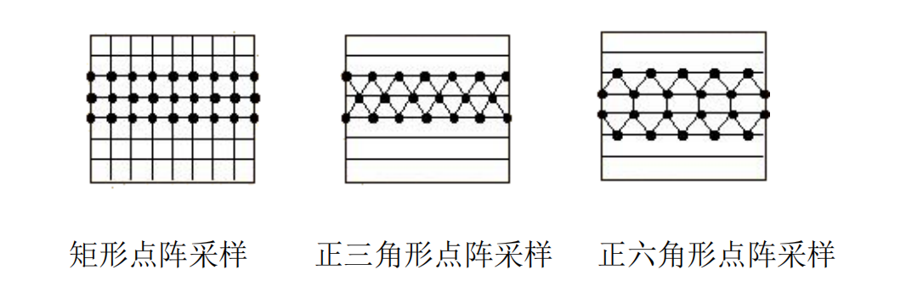
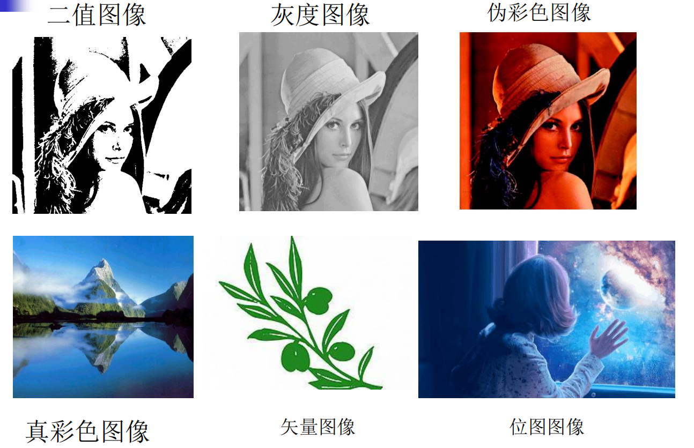
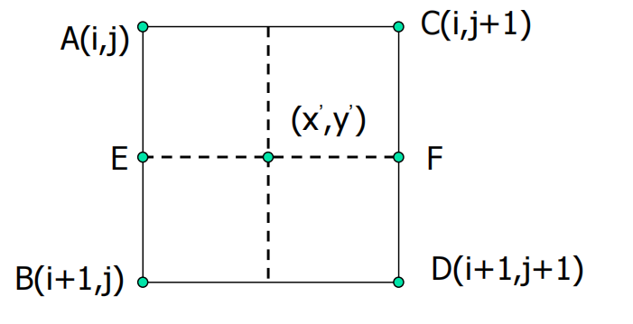
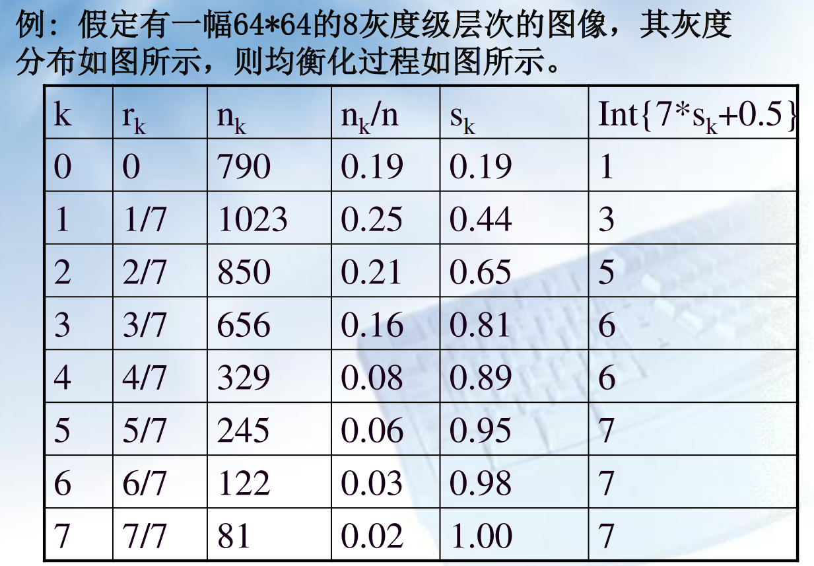
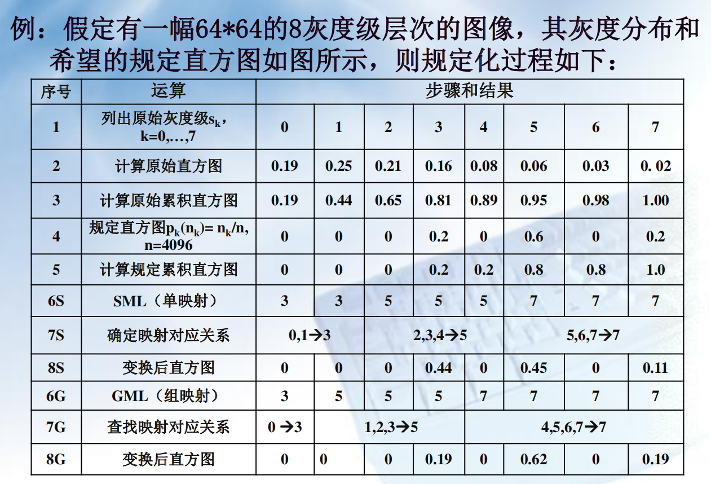
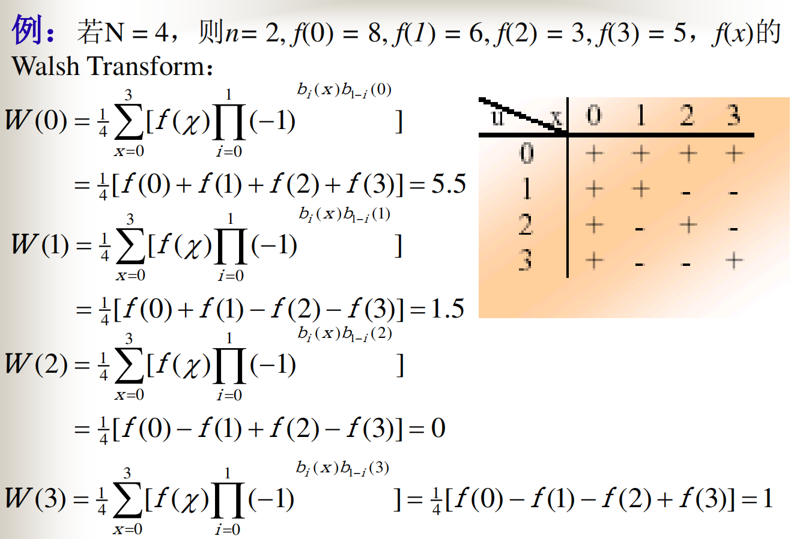
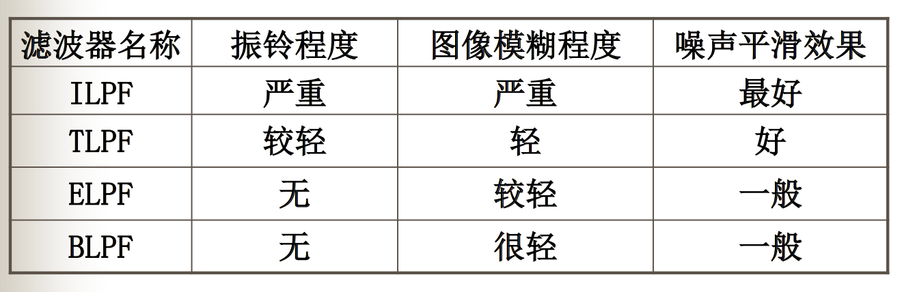
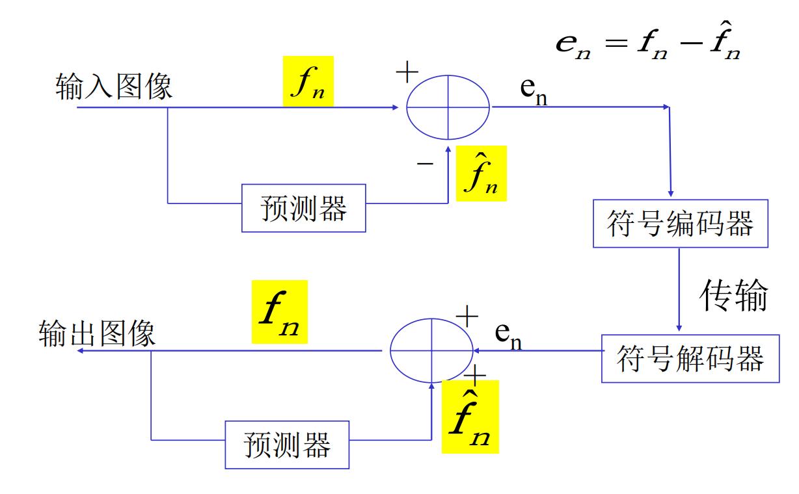
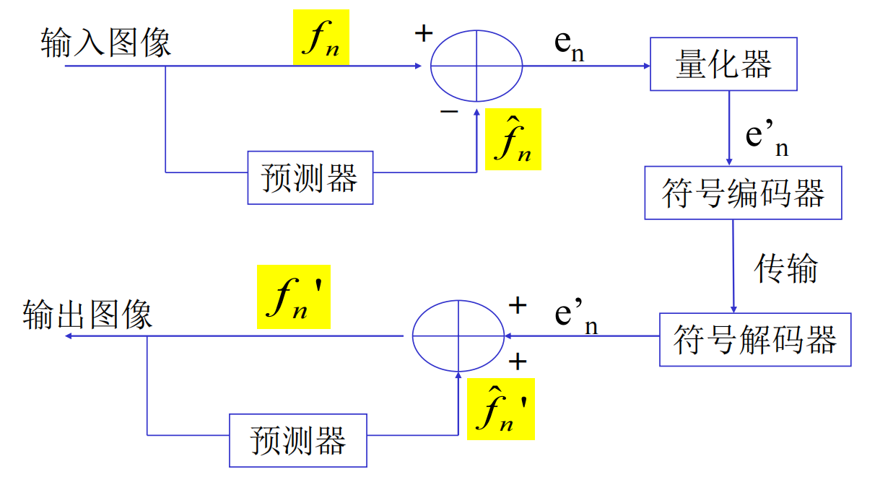
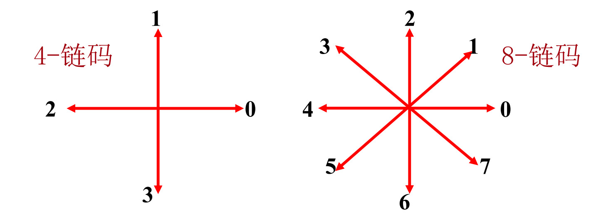

# 数字图像处理与分析期末复习

## 第一章 绪论

### 采样量化

* 采样：连续图像$f(x, y)$划分为像素（pixels）

  

* 量化：

$$
f(x, y) = 
\begin{bmatrix}
f(0,0) & f(0,1) &... &f(0, N-1) \\
f(1,0) & f(1,1)&...&f(1, N-1) \\
\vdots & \vdots &\vdots&\vdots \\
f(M-1, 0)&f(M-1,1)&...&f(M-1,N-1)
\end{bmatrix}
$$

### 图像类型

#### 色彩分类

* **灰度图像**： 图像只有明暗程度的变化而没有色彩的变化， 最简单的是二值图像，只有两种灰度
* **伪彩色图像**：是指经过伪彩色处理而形成的彩色图像。其像素值是所谓的索引值，是按照灰度值进行彩色指定 的结果，其色彩并不一定忠实于外界景物的真实色彩；
* **假彩色图像**：是指遥感多波段图象合成的彩色图像；
* **真彩色图像**：是忠实于外界景色的色彩的图像，其像素一般是颜色的真实值。

#### 运动分类

* **静止图像**：图像的内容不随时间变化。
* **活动图像**：前一帧和后一帧的图象内容随时间发生变化。

#### 结构分类

* **矢量图像**：由描述像素点阵的一组数据刻画的图像。

* **点阵图像(位图图像)**：由像素点阵所组成的图像。

### 色彩模式

* RGB模式：加色模式，由红绿蓝叠加（真彩）
* CMYK模式，K指黑色：当阳光照射到一个物体上时，反射的光就是所看到的物体的颜色。这是一种减色模式。

## 第二章 图像和视觉基础

### 人眼的视觉特性

* **人的视觉适应范围大**：只要对比度保持一定，亮度即使在很宽范围内变动，人的亮度感受也是相同的——**亮度恒定**
* **亮度适应**
* **亮度区分**：
  * Weber定律：当背景宽广且亮度均匀，则$\Delta I$（光斑额外亮度）很大范围内近似同$I$（背景亮度）成正比，最优照明条件下$\Delta I / I$为一常数其值约为0.01。

* **同时对比度**：视觉受到外界因素影响
* **视觉惰性**：人眼对亮度改变进行跟踪的滞后性质

### 正投影变换

* 空间点齐次坐标$W_h=\begin{bmatrix}kX&kY&kZ&k\end{bmatrix}$

* 摄像机齐次坐标：$C_h=p\cdot W_h$

  * 透视矩阵：
    $$
    p = 
    \begin{bmatrix}
    1&0&0&0\\
    0&1&0&0\\
    0&0&1&0\\
    0&0&-\frac1\lambda &1
    \end{bmatrix}
    $$

* 摄像机笛卡尔坐标：将$C_h$所有项除以最后一项$k(\frac{\lambda-Z}\lambda)$，再去除最后一项，得到笛卡尔坐标
  $$
  C =
  \begin{bmatrix}
  \frac{\lambda X}{\lambda-Z} &\frac{\lambda Y}{\lambda-Z} &\frac{\lambda Z}{\lambda-Z}
  \end{bmatrix}^T
  $$

* 图像坐标：$\begin{bmatrix}
  \frac{\lambda X}{\lambda-Z} &\frac{\lambda Y}{\lambda-Z} 
  \end{bmatrix}^T$

### 逆投影变换

* 正变换为多对一，而逆变换为一对多，需要修正齐次坐标的$Z$分量：
  $$
  C_h =
  \begin{bmatrix}
  kx &ky &kz &k
  \end{bmatrix}^T
  $$

* 逆透视矩阵：
  $$
  p^{-1} = 
  \begin{bmatrix}
  1&0&0&0\\
  0&1&0&0\\
  0&0&1&0\\
  0&0&\frac1\lambda &1
  \end{bmatrix}
  $$

* 逆投影变换：

  $W_h = p^{-1}\cdot C_h = \begin{bmatrix}kx&ky&kz&k\frac{\lambda+z}\lambda\end{bmatrix}$

  $W=\begin{bmatrix}\frac{\lambda x}{\lambda+z}&\frac{\lambda y}{\lambda+z}&\frac{\lambda z}{\lambda+z}\end{bmatrix}$

  可以得到$Z = \frac{\lambda z}{\lambda+z}$，带入$X,Y$的表达式：

  $X = \frac{x}{\lambda}(\lambda-Z), Y = \frac{y}{\lambda}(\lambda-Z)$

### 像素的联系

#### 像素邻域

* 象素点p的4邻域$N_4(p)$
* 象素点p的4对角$N_D(p)$
* 象素点p的8邻域$N_8(p)$

#### 连通性

* 4-连接：2个象素p和r在V中取值且r在$N_4(p)$中；

* 8-连接：2个象素p和r在V中取值且r在$N_8(p)$中；

* M-连接：2个象素p和r在V中取值且满足下列条件之一：

  * r在$N_4(p)$中
  * r在$N_D(p)$中且$N_4(p)\cap N_4(r) = \phi$

#### 距离量度

象素点 $p(x,y),q(s,t)$

* 欧式距离：$D_E(p,q)=[(x-s)^2+(y-t)^2]^{1/2} $
* 街区距离：$D_4(p,q)=|x-s|+|y-t| $
* 棋盘距离：$D_8(p,q)=max(|x-s|,|y-t|) $

### 图像代数运算

#### 加法：多帧平均降噪

* 加法定义：$C(x,y) = A(x,y)+B(x,y)$

* 加性噪声$D_i(x,y) = S(x,y)+N_i(x,y), 随机噪声互不相关、均值为零$

* 功率信噪比：
  $$
  P(x,y) = \frac{S^2(x,y)}{E[N^2(x,y)]}
  $$

* 对M幅图像求平均:
  $$
  \overline D(x,y) = S(x,y) + \frac1M\sum_{i=1}^MN_i(x,y)
  $$

* 平均以后的功率信噪比：
  $$
  \overline P(x,y) = MP(x,y)
  $$

#### 减法

* 减法定义：$C(x,y) = A(x,y)-B(x,y)$

* 去除混合在前景中的背景信息——蓝屏技术

* 检测同一场景两幅图像之间的变化

* 计算物体边界的梯度

  * 水平垂直差分法：
    $$
    G[F(x,y)] = ((F(x,y)-F(x+1,y))^2+(F(x,y)-F(x,y+1))^2)^{1/2} \\
    G[F(x,y)] = |F(x,y)-F(x+1,y)|+|F(x,y)-F(x,y+1)| \\
    G[F(x,y)] = max(|F(x,y)-F(x+1,y)|,|F(x,y)-F(x,y+1)|)
    $$

  * 交叉差分法：
    $$
    G[F(x,y)] = ((F(x,y)-F(x+1,y+1))^2+(F(x+1,y)-F(x,y+1))^2)^{1/2} \\
    G[F(x,y)] = |F(x,y)-F(x+1,y+1)|+|F(x+1,y)-F(x,y+1)| 
    $$

#### 乘法

* 乘法定义：$C(x,y) = A(x,y)\times B(x,y)$
* 图像局部显示：用二值蒙版与原图像做乘法

#### 除法

* 除法定义：$C(x,y) = A(x,y) / B(x,y)$

* 检测两幅图像之间的区别，亮出差异较大

### 图像逻辑运算

* 求反：$g(x,y) = 255-f(x,y)$
* 与运算：$g(x,y) = f(x,y) \cap h(x,y)$，保留白色交集
* 或运算：$g(x,y) = f(x,y) \cup h(x,y)$，保留白色并集
* 异或运算：$g(x,y) = f(x,y) \otimes h(x,y)$，相同部分为白色

### 空间变换

* 平移变换：
  $$
  \begin{bmatrix}
  X'\\
  Y'\\
  Z'\\
  1
  \end{bmatrix}
   = 
  \begin{bmatrix}
  1&0&0&X_0\\
  0&1&0&Y_0\\
  0&0&1&Z_0\\
  0&0&0&1
  \end{bmatrix}
  \begin{bmatrix}
  X\\
  Y\\
  Z\\
  1
  \end{bmatrix}
  $$

* 尺度变换：
  $$
  \begin{bmatrix}
  X'\\
  Y'\\
  Z'\\
  1
  \end{bmatrix}
   = 
  \begin{bmatrix}
  S_X&0&0&0\\
  0&S_Y&0&0\\
  0&0&S_Z&0\\
  0&0&0&1
  \end{bmatrix}
  \begin{bmatrix}
  X\\
  Y\\
  Z\\
  1
  \end{bmatrix}
  $$

* 旋转变换：

  * 平移B到原点、绕原点旋转、平移点B回到原始位置

  * 绕原点旋转：
    $$
    \begin{bmatrix}
    X'\\
    Y'\\
    1
    \end{bmatrix}
     = 
    \begin{bmatrix}
    cos\theta&sin\theta&0\\
    -sin\theta&cos\theta&0\\
    0&0&1
    \end{bmatrix}
    \begin{bmatrix}
    X\\
    Y\\
    1
    \end{bmatrix}
    $$

* 几何运算实现方法：

  * 向前映射计算法：从原图像坐标计算出目标图像坐标——镜像、平移变换
  * 向后映射计算法：从结果图像的坐标计算原图像的坐标——旋转、拉伸、放缩

### 灰度插值

#### 最近邻插值（0阶）

* $f(x,y)=f(Round(x),Round(y)),其中 Round(x) 为四舍五入函数$

#### 双线性插值（1阶）

$$
g(E)=(x’-i)[g(B)-g(A)]+g(A) \\
g(F)=(x’-i)[g(D)-g(C)]+g(C) \\
g(x’,y’)=(y’-j)[g(F)-g(E)]+g(E) 
$$

* 缺陷：平滑作用使得图像细节退化，放大导致模糊

## 第三章 图像空间域增强

### 点处理增强

* 分段线性变换
  $$
  f'(i,j) =
  \left\{
  \begin{array}
  a
  \frac{c'-a'}{c-a}(f(i,j)-a)+a'\ a\le f(i,j) \le c \\
  \frac{d'-c'}{d-c}(f(i,j)-c)+c'\ c\le f(i,j) \le d \\
  \frac{b'-d'}{b-d}(f(i,j)-d)+d'\ d\le f(i,j) \le b \\
  \end{array}
  \right.
  $$
  如果变换后的区间范围大于变换前，则为扩展，否则为压缩

* 非线性变换
  $$
  f'(i,j) = \frac{\log b'-\log a'}{\log b-\log a}(\log f(i,j)-\log a)+a'
  $$
  

### 直方图增强

#### 直方图均衡

(1)统计图像中各灰度级像素个数 

(2)计算直方图$p_r(r_k) = \frac{n_k}n$：

(3)计算累积直方图：$s_k = T(r_k) = \sum_{j=0}^k \frac{n_k}n$

(4)取整$S_k=int[(L-1)s_k+0.5]$

(5)确定映射对应关系：$k\rightarrow S_k$

(6)对图像进行增强变换$S_k\rightarrow k$

* 结论
  * 变换后直方图趋向平坦，灰级减少，灰度合并。
  * 原始变换后有些灰度级消失，含有像素数多的几个灰级间隔被拉大了。

### 直方图规定化

* 将直方图转化为规定的样子

* 算法步骤：

  * 计算原始直方图
  * 计算原始累计直方图
  * 列出要求的规定直方图
  * 计算累计规定直方图
  * 单映射：
    * 对每一个累计直方图的条目，找到和它最接近的规定累计直方图的项，建立映射
    * 变换：将被映射的条目分布改为所有映射到它的直方图条目之和
  * 组映射：
    * 对于每一个规定累计直方图的条目，找到距离其最近的原始累计直方图条目，将比这个编号小且没有映射的所有整数都映射到这个条目
    * 变换：将被映射的条目分布改为所有映射到它的直方图条目之和

  

## 平滑滤波器

### 线性平滑滤波

* 邻域平均法：以$(i,j)$为中心取一个正方形窗口，则$g(i,j) = \frac1{N\times N}\sum_{(x,y)\in A}f(x,y)$
* 超限邻域平均法：和邻域平均法类似，但只有当某个像素的灰度值大于一定水平才用邻域像素平均值
* 加权邻域平均法：选择一个窗口，邻点灰度差越大，权值越小
* 特点：
  * 引发模糊现象
  * 适用于高斯噪声

### 非线性平滑滤波：中值滤波

* 原理：
  * 用一个正方形窗口滑动
  * 将窗口内所有灰度值排序，选择中位数作为中心点的像素值
* 效果：消除脉冲噪声、较好的保护边缘轮廓，适用于椒盐噪声
* 超限中值滤波：只有当灰度超过一定水平才进行中值滤波

## 锐化滤波器

### 一阶差分

* 对于所有算子，其矩阵中心点为本点，上下左右各个元素就是对应的坐标前需要乘的系数，然后对于两个算子算其平方和的平方根

* Robert算子：
  $$
  \begin{bmatrix}
  1&0\\
  -1&0\\
  \end{bmatrix}
  \begin{bmatrix}
  1&-1\\
  0&0\\
  \end{bmatrix}
  $$

* Prewitt算子：
  $$
  \begin{bmatrix}
  -1&-1&-1\\
  0&0&0\\
  1&1&1
  \end{bmatrix}
  \begin{bmatrix}
  1&0&-1\\
  1&0&-1\\
  1&0&-1
  \end{bmatrix}
  $$

* Sobel算子：
  $$
  \begin{bmatrix}
  -1&-2&-1\\
  0&0&0\\
  1&2&1
  \end{bmatrix}
  \begin{bmatrix}
  1&0&-1\\
  2&0&-2\\
  1&0&-1
  \end{bmatrix}
  $$
  前者对水平边缘有较强响应，后者对垂直边缘有较强响应

* Kirsch算子：用三个相邻邻点的加权和的五倍减去另外五个相邻邻点的加权和的三倍，这八个邻点按照顺时针旋转，取最大的情况。

* Canny算子：最优边缘检测器

  step1: 用高斯滤波器平滑图象；

  step2: 用一阶偏导的有限差分来计算梯度的幅值和方向；

  step3: 对梯度幅值进行非极大值抑制；

  step4: 用双阈值算法检测和连接边缘。

### 二阶差分

* 拉普拉斯算子：
  $$
  \begin{bmatrix}
  0&1&0\\
  1&-4&1\\
  0&1&0
  \end{bmatrix}
  $$
  对噪声敏感、产生双边缘、缓慢区域产生暗背景

* 复合拉普拉斯算子：
  $$
  f'(i,j) =
  \left\{
  \begin{array}
  a
  f(x,y) - \nabla^2f(x,y)\ 如果中心系数为负\\
  f(x,y) + \nabla^2f(x,y)\ 如果中心系数为正
  \end{array}
  \right.
  $$

## 第四章 图像变换

### 傅里叶变换

* 积分：
  $$
  H(u) = \int_{-\infty}^\infty h(t)e^{-j2\pi ut}dt
  $$

* 一维DFT：
  $$
  F(u) = \frac1N\sum_{x=0}^{N-1}f(x)e^{-j\frac{2\pi ux}N}
  $$
  逆变换：
  $$
  f(x) = \sum_{u=0}^{N-1}F(u)e^{-j\frac{2\pi ux}N}
  $$

* 二维DFT：
  $$
  F(u,v) = \frac1N\sum_{x=0}^{N-1}\sum_{y=0}^{N-1}f(x,y)e^{-j\frac{2\pi (ux+vy)}N}
  $$
  逆变换：
  $$
  f(x,y) = \frac1N\sum_{u=0}^{N-1}\sum_{v=0}^{N-1}F(u,v)e^{-j\frac{2\pi (ux+vy)}N}
  $$

### 傅里叶变换的性质

* 分离性：可以先在Y方向做一维傅里叶变换，再在X方向做一维傅里叶变换

* 位移定理：
  $$
  f(x,y)e^{j2\pi (u_0x+v_0y)/N} \leftrightarrow F(u-u_0, v-v_0)\\
  f(x-x_0,y-y_0) \leftrightarrow F(u, v)e^{-j2\pi (ux_0+vy_0)/N}
  $$

* 周期性：
  $$
  F(u,v) = F(u+N, v+N) \\
  F(u,v )=F^*(-u, -v)
  $$

* 旋转性：
  $$
  f(r, \theta) \leftrightarrow F(w, \phi)\\
  f(r, \theta+\theta_0) \leftrightarrow F(w, \phi+\theta_0)
  $$

* 加法定理：
  $$
  \mathcal F[f_1(x,y)+ f_2(x,y)] =\mathcal F[f_1(x,y)]+\mathcal F [f_2(x,y)]\\
  af(x, y) \leftrightarrow aF(u,v)
  $$

* 尺度变换：
  $$
  f(ax, by) \leftrightarrow \frac1{|ab|}F(u/a,v/b)
  $$

* 卷积定理：

  二维卷积：$f*g=\sum_{a=-\infty}^\infty\sum_{b=-\infty}^\infty f(a,b)g(x-a, y-b)$
  $$
  f*g=F\cdot G\\
  f \cdot g = F *G
  $$

* 功率谱：
  $$
  P(u,v) = |F(u,v)|^2
  $$
  即为自相关函数的傅里叶变换：
  $$
  R_f(s)=F\{R_f(\tau)\}= F\{f(t)*f(-t)\}=F(s)F(-s)= F(s)F^*(s)=|F(s)|^2
  $$

### DCT离散余弦变换

* 傅立叶变换中当**f(x)**或**f(x,y)**为偶函数时，变换的计算公式只有余弦项。

* 一维余弦变换：
  $$
  F(u)=\sqrt\frac2N \sum_{x=0}^{N-1} f(x)cos[\frac{\pi (2x+1)u}{2N}]\\
  F(0) = \sqrt\frac1N\sum_{x=0}^{N-1} f(x)
  $$
  逆变换：
  $$
  f(x)=\sqrt\frac2N \sum_{u=0}^{N-1} C(u)F(u)cos[\frac{\pi (2x+1)u}{2N}]\\
  C(u) =
  \left\{
  \begin{array}
  a
  \frac1{\sqrt2}\ u=0\\
  1\ u \ne0
  \end{array}
  \right.
  $$

* 二维余弦变换：
  $$
  F(u,v)=\frac2N C(u)C(v)\sum_{x=0}^{N-1} \sum_{y=0}^{N-1}f(x,y)cos[\frac{\pi (2x+1)u}{2N}]cos[\frac{\pi (2y+1)v}{2N}]\\
  f(x,y)=\frac2N C(u)C(v)\sum_{u=0}^{N-1} \sum_{v=0}^{N-1}F(u,v)cos[\frac{\pi (2x+1)u}{2N}]cos[\frac{\pi (2y+1)v}{2N}]\\
  $$

### Walsh变换

* 一维变换：
  $$
  W(u) = \frac1N\sum_{x=0}^{N-1}f(x)\prod_{i=0}^{n-1}(-1)^{b_i(x)b_{n-1-i}(u)}\\
  f(x) = \sum_{u=0}^{N-1}W(u)\prod_{i=0}^{n-1}(-1)^{b_i(x)b_{n-1-i}(u)}\\
  $$

* 二维变换：
  $$
  W(u,v) = \frac1N\sum_{x=0}^{N-1}\sum_{y=0}^{N-1}f(x,y)\prod_{i=0}^{n-1}(-1)^{b_i(x)b_{n-1-i}(u)+b_i(y)b_{n-1-i}(v)}\\
  f(x,y) = \frac1N \sum_{u=0}^{N-1} \sum_{v=0}^{N-1}W(u,v)\prod_{i=0}^{n-1}(-1)^{b_i(x)b_{n-1-i}(u)+b_i(y)b_{n-1-i}(v)}\\
  $$
  

### K-L变换

M幅图像，每幅图像$X_i = \begin{bmatrix}f_i(0,0)&f_i(0,1)&\dots&f(N-1, N-1)\end{bmatrix}^T$

* 求协方差矩阵：
  $$
  m_X=\frac1M\sum_{i=1}^MX_i \\
  C_x=\frac1M\sum_{i=1}^MX_iX_i^T-m_Xm_X^T
  $$

* 求解特征值和特征向量：
  $$
  C_xe_i=\lambda_ie_i\\
  \lambda_1 > ...>\lambda_N
  $$
  用特征向量组成矩阵$A$的行，即：
  $$
  C_XA^T=A^T\lambda
  $$
  得到K-L变换：
  $$
  Y=A(X-m_X) \\
  X=A^TY+m_X
  $$
  
* 特点：极好的去相关性

## 第五章 图像变换域增强

### 低通滤波器

* 低通滤波：
  $$
  G(u,v) = F(u,v)H(u,v)
  $$

* 理想低通滤波器（ILPF）
  $$
  H(u,v) = 
  \begin{cases}
  1&D(u,v) \le D_0\\
  0&D(u,v) > D_0
  \end{cases}
  $$

  * D~0~半径内的频率分量无损通过，圆外的频率分量会被滤除。起到平滑作用，去除小噪声；
  * 若滤除的高频分量中含有大量的边缘信息，会发生图像边缘模糊现像。
  * 产生振铃现像：输出图像的灰度剧烈变化处产生的震荡

* 巴特沃思低通滤波器（BLPF）
  $$
  H(u,v) = \frac1{1+[D(u,v)/D_0]^{2n}}
  $$

  * 没有明显的跳跃
  * 模糊程度减少
  * 尾部含有较多的高频，对噪声的平滑效果不如ILPF。

* 指数低通滤波器（ELPF）
  $$
  H(u,v)=e^{-[D(u,v)/D_0]^n}
  $$

* 梯形低通滤波器（TLPF）
  $$
  H(u,v) = 
  \begin{cases}
  1&D(u,v) < D_0\\
  \frac{D(u,v)-D_1}{D_0-D_1}& D_0 \le D(u,v) \le D_1\\
  0&D(u,v) > D_1
  \end{cases}
  $$

* 高斯低通滤波器
  $$
  H(u,v) = e^{-D^2(u,v)/2D_0^2}
  $$

  * 没有振铃效应

* 四种滤波器比较：

  

### 高通滤波器

* 理想高通滤波器（ILPF）
  $$
  H(u,v) = 
  \begin{cases}
  0&D(u,v) \le D_0\\
  1&D(u,v) > D_0
  \end{cases}
  $$

* 巴特沃思高通滤波器（BLPF）
  $$
  H(u,v) = \frac1{1+[D_0/D(u,v)]^{2n}}
  $$

* 指数高通滤波器（ELPF）
  $$
  H(u,v)=e^{-[D_0/D(u,v)]^n}
  $$

* 梯形高通滤波器（TLPF）
  $$
  H(u,v) = 
  \begin{cases}
  0&D(u,v) < D_1\\
  \frac{D(u,v)-D_1}{D_0-D_1}& D_1 \le D(u,v) \le D_0\\
  1&D(u,v) > D_0
  \end{cases}
  $$

* 高斯低通滤波器
  $$
  H(u,v) = 1-e^{-D^2(u,v)/2D_0^2}
  $$

## 第六章 图像恢复和重建

### 无约束恢复：逆滤波

* 图像退化模型：
  $$
  g(x,y) = f(x,y)*h(x,y)+n(x,y)\\
  G(u,v) = F(u,v)H(u,v)+N(u, v)
  $$

* 无噪声时：
  $$
  F(u,v) = G(u,v)/H(u,v) \\
  M(u,v) =
  \begin{cases}
  1&D^2(u,v) \le w_0\\
  1 /H(u,v) &D^2(u,v) > w_0
  \end{cases}
  $$
  
* 逆滤波容易产生较大振铃效应，改进：
  
  令$k,d<1$
  $$
  M(u,v) = 
  \begin{cases}
  k&H(u,v) \le d\\
  1 /H(u,v) &H(u,v) > d
  \end{cases}
  $$

* 匀速直线运动模糊消除：
  $$
  H(u,v) = \mathcal F(ux_0(t)+vy_0(t))
  $$
  $只沿x轴运动，x_0(t)=at/T$：
  $$
  H(u,v) = \int_0^T\exp[-j2\pi ux_0(t)]dt = \frac T{\pi ua}\exp(-j\pi ua)
  $$
  

###  维纳滤波

* 传递函数：
  $$
  H_w(u,v) = \frac1{H(u,v)} \frac{|H(u,v)|^2}{|H(u,v)|^2+s\frac{P_n(u,v)}{P_f(u,v)}}
  $$
  其中$P_n和P_f分别是f(x,y)和n(x,y)的功率谱$

* 特点：自动抑制噪声

* 若原图像功率谱未知：
  $$
  H_w(u,v) = \frac1{H(u,v)} \frac{|H(u,v)|^2}{|H(u,v)|^2+K}
  $$
  其中：
  $$
  K=\frac{n_A}{f_A} \\
  n_A=\frac1{MN}\sum_u\sum_vP_n(u,v)\\
  f_A=\frac1{MN}\sum_u\sum_vP_f(u,v)\\
  $$

* 优缺点：

  * 当复原的目的是供人观察时，均方误差准则并不是一个特别好的优化准则；
  * 经典的维纳滤波不能处理具有空间可变点扩散函数的情形；
  * 维纳滤波不能处理具有非平稳信号和噪声的情形。

### 有约束最小平方滤波

* 传递函数

  设将拉普拉斯算子扩展到图像尺寸的函数对应的傅里叶变换为$P(u,v)$
  $$
  H(u,v)=\frac{H^*(u,v)}{|H(u,v)|^2+s|P(u,v)|^2}
  $$

## 第七章 图像压缩编码

### 编码冗余

* 平均码长：灰度编码长度的概率加权平均
  $$
  L_{avg} = \sum_{k=0}^{L-1}l(S_k)P(S_k)
  $$

* 平均信息熵：灰度的出现概率及其对数乘积的和的相反数
  $$
  H(d) = -\sum_{i=1}^mp(d_i)log_2(p(d_i))
  $$

### 视觉冗余

* 可以忽略一些视觉不太明显的微小差异

### 哈夫曼编码

* 优点：最优码
* 缺点：哈夫曼树计算量大
* 可以将图像分成小块，分别进行独立哈夫曼编码

### 哈夫曼平移码

* 将所有符号概率由大到小排列，然后分成各有7个符号的n块，将第一块$a_1, ...,a_7$与$a_8'$进行哈夫曼编码，其中第八个的概率是剩余符号概率和
* 二元平移码：7个一组，第八个当成下一组的前缀

### 位平面编码

* 先对图像做平面分解：构建一系列二值位平面，将灰度值表示为二进制
* 进行二值图像编码

### 游程编码

* 将相同连续值用一个代表值和一个串长来表示
* 定长游程编码：编码游程用的串长二进制位数固定
* 变长游程编码：对不同范围的游程使用不同位数的串长二进制数进行编码

### 预测编码

* 无损预测：由1个编码器和1个解码器组成

* 哈夫曼编码、算术编码、游程编码

  

  预测器：通过前m个像素线性组合得到

* 有损编码：在无损编码的基础上增加一个量化器（差分脉码调制、德尔塔调制）

* 差分脉码调制，德尔塔调制

  

  * 最优线性预测就是选择合适的系数使得均方误差最小
  * 最优预测器：马尔科夫预测器

### 变换编码

* 图像数据经过蒸饺变换后，图像中绝大部分信息集中在少数几个变换系数上，通过对这些系数进行量化，实现对图像的压缩
* 正交变换的性质：熵保持、能量保持、能量集中、去相关
* 最常用的是DCT

### 帧间混合编码

* 首先在一帧内DCT编码，消除帧内相关性，然后在帧间采用DPCM（差分脉码调制）对误差进行编码，消除帧间相关

## 第八章 图像分割

### 基于边界分割

#### 梯度算子

* Robert算子：
  $$
  \begin{bmatrix}
  1&0\\
  -1&0\\
  \end{bmatrix}
  \begin{bmatrix}
  1&-1\\
  0&0\\
  \end{bmatrix}
  $$

* Prewitt算子：
  $$
  \begin{bmatrix}
  -1&-1&-1\\
  0&0&0\\
  1&1&1
  \end{bmatrix}
  \begin{bmatrix}
  1&0&-1\\
  1&0&-1\\
  1&0&-1
  \end{bmatrix}
  $$

* Sobel算子：
  $$
  \begin{bmatrix}
  -1&-2&-1\\
  0&0&0\\
  1&2&1
  \end{bmatrix}
  \begin{bmatrix}
  1&0&-1\\
  2&0&-2\\
  1&0&-1
  \end{bmatrix}
  $$

#### 边缘连接

* 边界闭合：利用梯度的幅度和方向进行边界闭合（填充小的间隙）
* 曲线拟合：如果边缘点核心数，可以用分段线性或高阶样条来拟合这些点
* Hough变换：检测已知形状的曲线
  * 直线：用极坐标表示，将两个参数量化为许多小格，把图像平面中的点映射到参数空间，然后找出最大凝聚点

### 基于区域分割

* 区域生长法：将具有相似性质的像素集合起来构成区域
  * 选取种子像素
  * 确定包括像素的准则
  * 制定生长停止的准则
* 区域分裂合并：将图像分割直到每个区域中的像素点具有相似性质，然后将相似区域合并
  * 优点：不需要种子像素；缺点：分割后有不连续边界
  * 四叉树分割合并：
    * P为分割准则
    * 如果P(R~i~)=false就将其分裂成不重叠的四份
    * 如果相邻区域$P(R_i \cup R_j)=true$就合并，直到不能分裂合并

### 基于纹理分割

* 灰度共生矩阵
  * $a_{ij}表示从灰度i的点离开某个固定位置关系(D_x,D_y)的点灰度为j的概率，也可以是满足这样条件的个数$
  * 表示空间灰度值依赖性的概率
  * 是对称的，与两个像素的距离和角度有关

* 灰度共生矩阵的纹理参数
  * 二阶矩：$f_1 = \sum_{i,j}P_{ij}^2$
    * 灰度分布均匀性度量，也称为能量
    * 纹理较粗，则能量较高
  * 熵：$f_2 = -\sum_{i,j}P_{ij}logP_{ij}$
    * 图像信息量的度量，如果没有任何纹理，熵接近于0
    * 若充满细纹理，则$P_{ij}$几乎都相等，熵此时最大
  * 对比度：$f_3=\sum_{i,j}|i-j|^kP_{ij}^l$
    * 度量清晰度，纹理沟纹越深，视觉效果越清晰
  * 相关：$f_4=(\sum_{i,j}ijP_{ij}-u_xu_y)/\sigma_x\sigma_y$
    * 衡量灰度共生矩阵行列方向相似度
    * 某图像在水平方向纹理主导，那么0度灰度共生矩阵相关值大于其他角度

### 基于形态学分割

* 集合关系：
  * S包含于B
  * S不包含于B
  * S击不中B
* 平移
* 膨胀：将与物体边界接触的背景像素合并到物体中的过程
* 腐蚀：讲一个物体沿边界减小的过程
* 开运算：腐蚀再膨胀
  * 删除小物体、将物体拆分为小物体、平滑大物体边界
* 闭运算：膨胀再腐蚀：
  * 填充物体的小洞、连接相近的物体、平滑物体边界

## 第九章 目标表达和描述

### 边界表达

* 链码：以边界方向为编码依据

  

  * 链码太长、噪声会引入不必要的编码
  * 改进：增大网格空间、将更多的线段标记成一个链码

* 首差循环链码：

  * 链码因为起点不同而不同、旋转也会引起链码变化
  * 起点归一后用差分来代替原来的链码

* 外形特征：

  * 利用一维函数来表示边界
  * 方法：做边界上点到质心的$r,\theta$函数
  * 改进：
    * 消除旋转影响：选择离质心最远的点作为起点
    * 消除比例影响：将函数值域映射到固定范围

### 区域表达

* 中轴变换算法：设R是一个区域，B为R的边界点，对于R中的点p，找p在B熵最近的邻居，如果p有多余一个邻居，则它为R的骨架
* 问题：计算量大
* 算法改进思想：不断删除边缘，但不移去顶点、不破坏连通性、不引起过度腐蚀
* 基本操作：
  * 对满足以下四个条件的点打标记，所有标记打完一并删除：
    * 邻域中1的个数在2到6之间（1个1表示端点，7个1表示删除后腐蚀）
    * 上右下左上的旋转顺序中0-1转换次数等于1（宽度为1的骨架点不会删除）
    * 上右下至少一个0
    * 右下左至少一个0
  * 对满足以下四个条件的点打标记，所有标记打完一并删除：
    * 邻域中1的个数在2到6之间（1个1表示端点，7个1表示删除后腐蚀）
    * 上右下左上的旋转顺序中0-1转换次数等于1（宽度为1的骨架点不会删除）
    * 左上右至少一个0
    * 下左上至少一个0
  * 反复前两步，直到没有点可以删除

### 边界描述

* 形状数：最小循环首差链码（链码通过旋转最小的一个）
  * 形状数的阶：序列长度，封闭图形形状数的阶是偶数
  * 问题：不具有尺度不变性
  * 改进：规整化网络：
    * 根据最大轴（图形中最长的直径）和最小轴（垂直于最大轴且能恰好覆盖）计算基本矩形
    * 若给定了形状数的阶，则选择离心率（最大轴长度除以最小轴长度）与基本矩形最近的矩形
* 傅里叶描述符：
  * 边界点复数表示
  * 离散傅里叶变换
  * 只对编号为0-M的参数反变换
  * M越小，细节损失越多
  * 优点：对旋转平移放缩和起始点不敏感

### 区域描述

* 结构法：纹理分析算子LBP
  * 选择3*3邻域，从右侧开始逆时针阈值化，最后二进制数赋给中间点
* 模式分类：
  * 均匀模式：至多两次01翻转，对应纹理
  * 非均匀模式：超过两次翻转，对应噪声

## 第十章 彩色图像处理

### 彩色模型

#### RGB

* 红绿蓝三基色（真彩）
* 加色混色模型：适用于显示器等发光物体
* CIE混色图：混合色的亮度等于各个基色的亮度和

#### CMY

* 减色混色模型：适用于彩色打印、印刷行业等
* 青、品红、黄，为RGB的补色
* CMYK：K是黑色，印刷行业

#### HSI

* H色调（颜色波长），S饱和度（深浅），I亮度
* 反映了人视觉对于彩色的感觉

#### YUV

* Y亮度，UV色差信号
* 电视信号格式

#### YCbCr格式

* Y亮度，Cb Cr色差
* 彩色图像压缩的编码
* YUV侧重简单转化，YCbCr侧重冗余量去除

### 伪彩色处理

* 将黑白图像转化为彩色图像
* 提高人眼对图像的细节分辨能力
* 伪彩色：像素当做彩色查找表入口地址，读出一个RGB强度值
* 方法：
  * 亮度切割法：将图像根据亮度对应若干区域，每个区域一种颜色
  * 灰度到彩色变换：用灰度对RGB映射
  * 频域滤波：设计相应通道的滤波器
* 假彩色：输入输出均为彩色图片，但换了加颜色，用于遥感

### 彩色平衡

* 从图中选出两个颜色为灰色的点，以某一个分量为基准匹配剩余两个分量，根据变换后的颜色和变换前的颜色，求解四个线性方程就可以得到参数，再对全图做变换

### 彩色图像去噪

* 如果三个通道都收到影响，那么合成的彩色图像噪声弱于单个噪声

* HSI格式下，H和S噪声明显，I噪声弱

* 方法：

  * 平滑滤波：

    * 均值滤波：分别对RGB分量进行均值滤波

    * 中值滤波：将三个分量相加得到一个标量值排序，进行中值滤波

      缺点：彩色“渗色”

  * 锐化滤波

### 彩色补偿

* 在图像上找到主观视觉看是纯红绿蓝的三个点，计算真RGB：
  $$
  R^*=0.3R_1+0.59G_1+0.11B_1\\
  G^*=0.3R_2+0.59G_2+0.11B_2\\
  B^*=0.3R_3+0.59G_3+0.11B_3\\
  $$
  

* 建立变换矩阵：
  $$
  A_1=
  \begin{bmatrix}
  R_1&R_2&R_3\\
  G_1&G_2&G_3\\
  B_1&B_2&B_3
  \end{bmatrix}
  &
  A_2=
  \begin{bmatrix}
  R^*&0&0\\
  0&G^*&0\\
  0&0&B^*
  \end{bmatrix}
  $$

* 进行变换，S为新矩阵
  $$
  C=A_1A_2^{-1}\\
  S=C^{-1}F
  $$
  

* 作用：通过不同颜色通道提取不同目标物

## 第十一章 图像处理应用实例

### 特征选择

* 直接选择法：在满足可分离性判据的前提下，直接从原始特征中选取一组特征子集
  * 可分离性判据
    * 基于距离：类内距离小，类间距离大
    * 概率分布：散度越大，分类错误率越小
    * 熵：熵越小，划分越准确

* 搜索选择策略：

  * 分支定界法：计算量大
    $$
    J_D(x_i+x_j) \ge J_D(x_i)
    $$

  * 序列前向选择法：自下而上

    * 将特征子集初始化为一个空集
    * 每次选择一个特征，使得$J_D$最大
    * 特征数增加到m为止

  * 序列后向选择法：自上而下

    * 将特征子集初始化为全集
    * 每次去掉一个特征，使得$J_D$最大
    * 特征数到m为止

### 遗传算法

* 选择算子：轮盘赌选择法：
  * 计算每个个体适应度f
  * 计算每个个体被艺术传到下一代中的选择概率p(x~i~)
  * 计算每个个体的累计概率q~i~
  * 在[0,1]内产生一个均匀分布随机数r
  * 若$r\le q_1则q_1被选中，若q_{k-1}<r\le q_k，则x_k被选中$
  * 重复上述两步M次
* 交叉算子：
  * 以交叉概率p选择参与交叉的个体，并将选出的个体两两配对，每一对用单点交叉或两点交叉产生两个后代
* 变异算子
  * 变异操作以很小的概率p，随机的改变某个位置的值

### 分类

* 线性分类器
* 贝叶斯分类器
* 支持向量机：求解正确划分的几何间隔最大超平面

### 模糊识别

* 隶属函数：
  $$
  \mu_A(u)\in[0,1]
  $$
  越接近1，则越看着属于A

* 模糊集合的表示
  $$
  A=\{(u,\mu_A(u)), u\in U\}
  $$
  

* 模糊集合的运算：
  $$
  A = B \leftrightarrow\mu_A(u) = \mu_B(u)\\
  A \subset B\leftrightarrow\mu_A(u) \le \mu_B(u)\\
  A \cup B:\mu_{A\cup B}(u) = \max(\mu_A(u), \mu_B(u))\\
  A \cap B:\mu_{A\cap B}(u) = \min(\mu_A(u), \mu_B(u))\\
  A^C:\mu_{A^C}(u) = 1-\mu_A(u)
  $$
  

*  隶属函数的确定：

  * 模糊统计法：通过统计实验，计算U中每个元素对于A的隶属频率

* 模糊识别原则：

  * 最大隶属原则

    设$u_i对模糊集合A_j的隶属函数\mu_{A_j}(u_i)为b_{ij}$

    若有$b_{is} = \max[b_{i1}, b_{i2}, ...,b_{in}]$，则$u_i$属于S类
